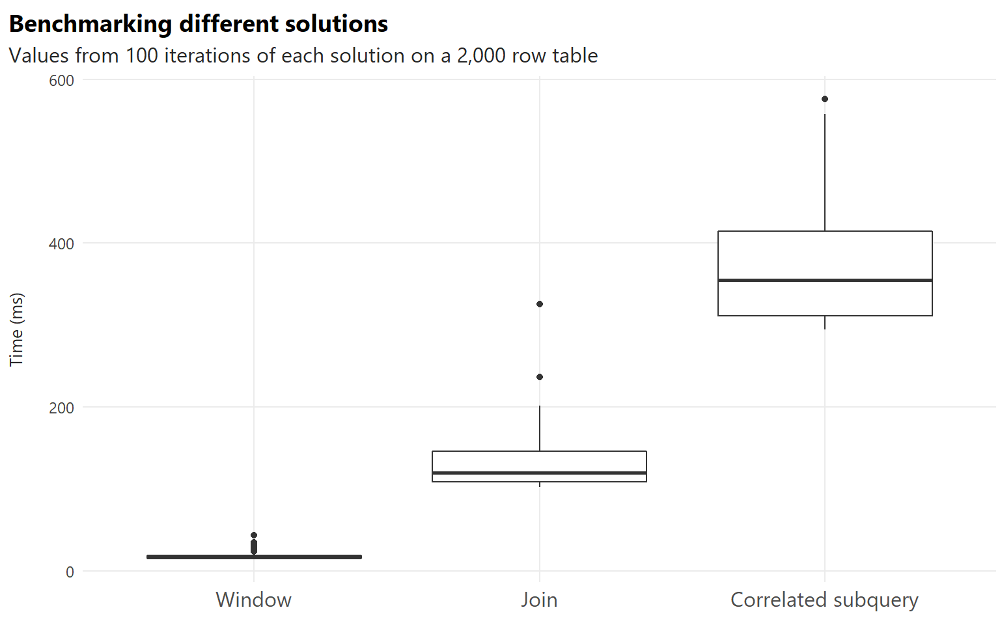

## Introduction

During the first half of 2021, as I was finishing up my M.A. thesis, I started searching for a job in Data Analytics. [My journey into analytics was through learning R](https://amitlevinson.com/blog/my-year-in-r/) and I realized I had to learn some SQL, or at least familiarize myself with it.

Fast forward to interviewing, and most of the SQL interview questions were relevant and interesting, with one question particularly motivating further thoughts; this blog post details that question and several answers to it.

**The question and data have no connection my current employer.** The data used here is made up and the question came from a different company altogether.

I'll be using R to setup a local SQL connection but power through the blog post with actual SQL code. While not necessary, some SQL knowledge is useful to understanding the various answers', and more so the syntax.

## The Interview question

So here it goes:

> Let's say you have a table of users' payments. The table has the user's name, date of payment and the amount they received. Users have multiple records with different amounts and dates. For each user, return: the user name, the maximum amount they received and the date of that payment.

> Once you solve that, solve it again using a different approach.

For a more practical example, consider the following raw data:

<div id="mklulllpbg" style="overflow-x:auto;overflow-y:auto;width:auto;height:auto;">
<style>html {
  font-family: -apple-system, BlinkMacSystemFont, 'Segoe UI', Roboto, Oxygen, Ubuntu, Cantarell, 'Helvetica Neue', 'Fira Sans', 'Droid Sans', Arial, sans-serif;
}

#mklulllpbg .gt_table {
  display: table;
  border-collapse: collapse;
  margin-left: auto;
  margin-right: auto;
  color: #333333;
  font-size: 16px;
  font-weight: normal;
  font-style: normal;
  background-color: #FFFFFF;
  width: auto;
  border-top-style: solid;
  border-top-width: 2px;
  border-top-color: #A8A8A8;
  border-right-style: none;
  border-right-width: 2px;
  border-right-color: #D3D3D3;
  border-bottom-style: solid;
  border-bottom-width: 2px;
  border-bottom-color: #A8A8A8;
  border-left-style: none;
  border-left-width: 2px;
  border-left-color: #D3D3D3;
}

#mklulllpbg .gt_heading {
  background-color: #FFFFFF;
  text-align: center;
  border-bottom-color: #FFFFFF;
  border-left-style: none;
  border-left-width: 1px;
  border-left-color: #D3D3D3;
  border-right-style: none;
  border-right-width: 1px;
  border-right-color: #D3D3D3;
}

#mklulllpbg .gt_title {
  color: #333333;
  font-size: 125%;
  font-weight: initial;
  padding-top: 4px;
  padding-bottom: 4px;
  padding-left: 5px;
  padding-right: 5px;
  border-bottom-color: #FFFFFF;
  border-bottom-width: 0;
}

#mklulllpbg .gt_subtitle {
  color: #333333;
  font-size: 85%;
  font-weight: initial;
  padding-top: 0;
  padding-bottom: 6px;
  padding-left: 5px;
  padding-right: 5px;
  border-top-color: #FFFFFF;
  border-top-width: 0;
}

#mklulllpbg .gt_bottom_border {
  border-bottom-style: solid;
  border-bottom-width: 2px;
  border-bottom-color: #D3D3D3;
}

#mklulllpbg .gt_col_headings {
  border-top-style: solid;
  border-top-width: 2px;
  border-top-color: #D3D3D3;
  border-bottom-style: solid;
  border-bottom-width: 2px;
  border-bottom-color: #D3D3D3;
  border-left-style: none;
  border-left-width: 1px;
  border-left-color: #D3D3D3;
  border-right-style: none;
  border-right-width: 1px;
  border-right-color: #D3D3D3;
}

#mklulllpbg .gt_col_heading {
  color: #333333;
  background-color: #FFFFFF;
  font-size: 100%;
  font-weight: normal;
  text-transform: Capitalize;
  border-left-style: none;
  border-left-width: 1px;
  border-left-color: #D3D3D3;
  border-right-style: none;
  border-right-width: 1px;
  border-right-color: #D3D3D3;
  vertical-align: bottom;
  padding-top: 5px;
  padding-bottom: 6px;
  padding-left: 5px;
  padding-right: 5px;
  overflow-x: hidden;
}

#mklulllpbg .gt_column_spanner_outer {
  color: #333333;
  background-color: #FFFFFF;
  font-size: 100%;
  font-weight: normal;
  text-transform: Capitalize;
  padding-top: 0;
  padding-bottom: 0;
  padding-left: 4px;
  padding-right: 4px;
}

#mklulllpbg .gt_column_spanner_outer:first-child {
  padding-left: 0;
}

#mklulllpbg .gt_column_spanner_outer:last-child {
  padding-right: 0;
}

#mklulllpbg .gt_column_spanner {
  border-bottom-style: solid;
  border-bottom-width: 2px;
  border-bottom-color: #D3D3D3;
  vertical-align: bottom;
  padding-top: 5px;
  padding-bottom: 5px;
  overflow-x: hidden;
  display: inline-block;
  width: 100%;
}

#mklulllpbg .gt_group_heading {
  padding-top: 8px;
  padding-bottom: 8px;
  padding-left: 5px;
  padding-right: 5px;
  color: #333333;
  background-color: #FFFFFF;
  font-size: 100%;
  font-weight: initial;
  text-transform: inherit;
  border-top-style: solid;
  border-top-width: 2px;
  border-top-color: #D3D3D3;
  border-bottom-style: solid;
  border-bottom-width: 2px;
  border-bottom-color: #D3D3D3;
  border-left-style: none;
  border-left-width: 1px;
  border-left-color: #D3D3D3;
  border-right-style: none;
  border-right-width: 1px;
  border-right-color: #D3D3D3;
  vertical-align: middle;
}

#mklulllpbg .gt_empty_group_heading {
  padding: 0.5px;
  color: #333333;
  background-color: #FFFFFF;
  font-size: 100%;
  font-weight: initial;
  border-top-style: solid;
  border-top-width: 2px;
  border-top-color: #D3D3D3;
  border-bottom-style: solid;
  border-bottom-width: 2px;
  border-bottom-color: #D3D3D3;
  vertical-align: middle;
}

#mklulllpbg .gt_from_md > :first-child {
  margin-top: 0;
}

#mklulllpbg .gt_from_md > :last-child {
  margin-bottom: 0;
}

#mklulllpbg .gt_row {
  padding-top: 8px;
  padding-bottom: 8px;
  padding-left: 5px;
  padding-right: 5px;
  margin: 10px;
  border-top-style: solid;
  border-top-width: 1px;
  border-top-color: #D3D3D3;
  border-left-style: none;
  border-left-width: 1px;
  border-left-color: #D3D3D3;
  border-right-style: none;
  border-right-width: 1px;
  border-right-color: #D3D3D3;
  vertical-align: middle;
  overflow-x: hidden;
}

#mklulllpbg .gt_stub {
  color: #333333;
  background-color: #FFFFFF;
  font-size: 100%;
  font-weight: initial;
  text-transform: inherit;
  border-right-style: solid;
  border-right-width: 2px;
  border-right-color: #D3D3D3;
  padding-left: 5px;
  padding-right: 5px;
}

#mklulllpbg .gt_stub_row_group {
  color: #333333;
  background-color: #FFFFFF;
  font-size: 100%;
  font-weight: initial;
  text-transform: inherit;
  border-right-style: solid;
  border-right-width: 2px;
  border-right-color: #D3D3D3;
  padding-left: 5px;
  padding-right: 5px;
  vertical-align: top;
}

#mklulllpbg .gt_row_group_first td {
  border-top-width: 2px;
}

#mklulllpbg .gt_summary_row {
  color: #333333;
  background-color: #FFFFFF;
  text-transform: inherit;
  padding-top: 8px;
  padding-bottom: 8px;
  padding-left: 5px;
  padding-right: 5px;
}

#mklulllpbg .gt_first_summary_row {
  border-top-style: solid;
  border-top-color: #D3D3D3;
}

#mklulllpbg .gt_first_summary_row.thick {
  border-top-width: 2px;
}

#mklulllpbg .gt_last_summary_row {
  padding-top: 8px;
  padding-bottom: 8px;
  padding-left: 5px;
  padding-right: 5px;
  border-bottom-style: solid;
  border-bottom-width: 2px;
  border-bottom-color: #D3D3D3;
}

#mklulllpbg .gt_grand_summary_row {
  color: #333333;
  background-color: #FFFFFF;
  text-transform: inherit;
  padding-top: 8px;
  padding-bottom: 8px;
  padding-left: 5px;
  padding-right: 5px;
}

#mklulllpbg .gt_first_grand_summary_row {
  padding-top: 8px;
  padding-bottom: 8px;
  padding-left: 5px;
  padding-right: 5px;
  border-top-style: double;
  border-top-width: 6px;
  border-top-color: #D3D3D3;
}

#mklulllpbg .gt_striped {
  background-color: rgba(128, 128, 128, 0.05);
}

#mklulllpbg .gt_table_body {
  border-top-style: solid;
  border-top-width: 2px;
  border-top-color: #D3D3D3;
  border-bottom-style: solid;
  border-bottom-width: 2px;
  border-bottom-color: #D3D3D3;
}

#mklulllpbg .gt_footnotes {
  color: #333333;
  background-color: #FFFFFF;
  border-bottom-style: none;
  border-bottom-width: 2px;
  border-bottom-color: #D3D3D3;
  border-left-style: none;
  border-left-width: 2px;
  border-left-color: #D3D3D3;
  border-right-style: none;
  border-right-width: 2px;
  border-right-color: #D3D3D3;
}

#mklulllpbg .gt_footnote {
  margin: 0px;
  font-size: 90%;
  padding-left: 4px;
  padding-right: 4px;
  padding-left: 5px;
  padding-right: 5px;
}

#mklulllpbg .gt_sourcenotes {
  color: #333333;
  background-color: #FFFFFF;
  border-bottom-style: none;
  border-bottom-width: 2px;
  border-bottom-color: #D3D3D3;
  border-left-style: none;
  border-left-width: 2px;
  border-left-color: #D3D3D3;
  border-right-style: none;
  border-right-width: 2px;
  border-right-color: #D3D3D3;
}

#mklulllpbg .gt_sourcenote {
  font-size: 90%;
  padding-top: 4px;
  padding-bottom: 4px;
  padding-left: 5px;
  padding-right: 5px;
}

#mklulllpbg .gt_left {
  text-align: left;
}

#mklulllpbg .gt_center {
  text-align: center;
}

#mklulllpbg .gt_right {
  text-align: right;
  font-variant-numeric: tabular-nums;
}

#mklulllpbg .gt_font_normal {
  font-weight: normal;
}

#mklulllpbg .gt_font_bold {
  font-weight: bold;
}

#mklulllpbg .gt_font_italic {
  font-style: italic;
}

#mklulllpbg .gt_super {
  font-size: 65%;
}

#mklulllpbg .gt_two_val_uncert {
  display: inline-block;
  line-height: 1em;
  text-align: right;
  font-size: 60%;
  vertical-align: -0.25em;
  margin-left: 0.1em;
}

#mklulllpbg .gt_footnote_marks {
  font-style: italic;
  font-weight: normal;
  font-size: 75%;
  vertical-align: 0.4em;
}

#mklulllpbg .gt_asterisk {
  font-size: 100%;
  vertical-align: 0;
}

#mklulllpbg .gt_slash_mark {
  font-size: 0.7em;
  line-height: 0.7em;
  vertical-align: 0.15em;
}

#mklulllpbg .gt_fraction_numerator {
  font-size: 0.6em;
  line-height: 0.6em;
  vertical-align: 0.45em;
}

#mklulllpbg .gt_fraction_denominator {
  font-size: 0.6em;
  line-height: 0.6em;
  vertical-align: -0.05em;
}
</style>
<table class="gt_table">
  
  <thead class="gt_col_headings">
    <tr>
      <th class="gt_col_heading gt_columns_bottom_border gt_left" rowspan="1" colspan="1">username</th>
      <th class="gt_col_heading gt_columns_bottom_border gt_left" rowspan="1" colspan="1">payment_date</th>
      <th class="gt_col_heading gt_columns_bottom_border gt_right" rowspan="1" colspan="1">amount</th>
    </tr>
  </thead>
  <tbody class="gt_table_body">
    <tr><td class="gt_row gt_left">Tom</td>
<td class="gt_row gt_left">2021-05-11</td>
<td class="gt_row gt_right">75</td></tr>
    <tr><td class="gt_row gt_left">Danny</td>
<td class="gt_row gt_left">2021-05-12</td>
<td class="gt_row gt_right">62</td></tr>
    <tr><td class="gt_row gt_left" style="background-color: #E5F6DF;">Alice</td>
<td class="gt_row gt_left" style="background-color: #E5F6DF;">2021-05-12</td>
<td class="gt_row gt_right" style="background-color: #E5F6DF;">85</td></tr>
    <tr><td class="gt_row gt_left">Alice</td>
<td class="gt_row gt_left">2021-05-29</td>
<td class="gt_row gt_right">72</td></tr>
    <tr><td class="gt_row gt_left" style="background-color: #E5F6DF;">Danny</td>
<td class="gt_row gt_left" style="background-color: #E5F6DF;">2021-06-12</td>
<td class="gt_row gt_right" style="background-color: #E5F6DF;">87</td></tr>
    <tr><td class="gt_row gt_left">Alice</td>
<td class="gt_row gt_left">2021-06-24</td>
<td class="gt_row gt_right">45</td></tr>
    <tr><td class="gt_row gt_left">Tom</td>
<td class="gt_row gt_left">2021-06-28</td>
<td class="gt_row gt_right">80</td></tr>
    <tr><td class="gt_row gt_left">Alice</td>
<td class="gt_row gt_left">2021-07-03</td>
<td class="gt_row gt_right">60</td></tr>
    <tr><td class="gt_row gt_left">Danny</td>
<td class="gt_row gt_left">2021-07-05</td>
<td class="gt_row gt_right">42</td></tr>
    <tr><td class="gt_row gt_left">Tom</td>
<td class="gt_row gt_left">2021-07-12</td>
<td class="gt_row gt_right">56</td></tr>
    <tr><td class="gt_row gt_left" style="background-color: #E5F6DF;">Tom</td>
<td class="gt_row gt_left" style="background-color: #E5F6DF;">2021-07-19</td>
<td class="gt_row gt_right" style="background-color: #E5F6DF;">95</td></tr>
    <tr><td class="gt_row gt_left">Danny</td>
<td class="gt_row gt_left">2021-08-01</td>
<td class="gt_row gt_right">80</td></tr>
  </tbody>
  
  
</table>
</div>

Return the following table (rows highlighted in light green):

<div id="vtndtuauoe" style="overflow-x:auto;overflow-y:auto;width:auto;height:auto;">
<style>html {
  font-family: -apple-system, BlinkMacSystemFont, 'Segoe UI', Roboto, Oxygen, Ubuntu, Cantarell, 'Helvetica Neue', 'Fira Sans', 'Droid Sans', Arial, sans-serif;
}

#vtndtuauoe .gt_table {
  display: table;
  border-collapse: collapse;
  margin-left: auto;
  margin-right: auto;
  color: #333333;
  font-size: 16px;
  font-weight: normal;
  font-style: normal;
  background-color: #FFFFFF;
  width: auto;
  border-top-style: solid;
  border-top-width: 2px;
  border-top-color: #A8A8A8;
  border-right-style: none;
  border-right-width: 2px;
  border-right-color: #D3D3D3;
  border-bottom-style: solid;
  border-bottom-width: 2px;
  border-bottom-color: #A8A8A8;
  border-left-style: none;
  border-left-width: 2px;
  border-left-color: #D3D3D3;
}

#vtndtuauoe .gt_heading {
  background-color: #FFFFFF;
  text-align: center;
  border-bottom-color: #FFFFFF;
  border-left-style: none;
  border-left-width: 1px;
  border-left-color: #D3D3D3;
  border-right-style: none;
  border-right-width: 1px;
  border-right-color: #D3D3D3;
}

#vtndtuauoe .gt_title {
  color: #333333;
  font-size: 125%;
  font-weight: initial;
  padding-top: 4px;
  padding-bottom: 4px;
  padding-left: 5px;
  padding-right: 5px;
  border-bottom-color: #FFFFFF;
  border-bottom-width: 0;
}

#vtndtuauoe .gt_subtitle {
  color: #333333;
  font-size: 85%;
  font-weight: initial;
  padding-top: 0;
  padding-bottom: 6px;
  padding-left: 5px;
  padding-right: 5px;
  border-top-color: #FFFFFF;
  border-top-width: 0;
}

#vtndtuauoe .gt_bottom_border {
  border-bottom-style: solid;
  border-bottom-width: 2px;
  border-bottom-color: #D3D3D3;
}

#vtndtuauoe .gt_col_headings {
  border-top-style: solid;
  border-top-width: 2px;
  border-top-color: #D3D3D3;
  border-bottom-style: solid;
  border-bottom-width: 2px;
  border-bottom-color: #D3D3D3;
  border-left-style: none;
  border-left-width: 1px;
  border-left-color: #D3D3D3;
  border-right-style: none;
  border-right-width: 1px;
  border-right-color: #D3D3D3;
}

#vtndtuauoe .gt_col_heading {
  color: #333333;
  background-color: #FFFFFF;
  font-size: 100%;
  font-weight: normal;
  text-transform: inherit;
  border-left-style: none;
  border-left-width: 1px;
  border-left-color: #D3D3D3;
  border-right-style: none;
  border-right-width: 1px;
  border-right-color: #D3D3D3;
  vertical-align: bottom;
  padding-top: 5px;
  padding-bottom: 6px;
  padding-left: 5px;
  padding-right: 5px;
  overflow-x: hidden;
}

#vtndtuauoe .gt_column_spanner_outer {
  color: #333333;
  background-color: #FFFFFF;
  font-size: 100%;
  font-weight: normal;
  text-transform: inherit;
  padding-top: 0;
  padding-bottom: 0;
  padding-left: 4px;
  padding-right: 4px;
}

#vtndtuauoe .gt_column_spanner_outer:first-child {
  padding-left: 0;
}

#vtndtuauoe .gt_column_spanner_outer:last-child {
  padding-right: 0;
}

#vtndtuauoe .gt_column_spanner {
  border-bottom-style: solid;
  border-bottom-width: 2px;
  border-bottom-color: #D3D3D3;
  vertical-align: bottom;
  padding-top: 5px;
  padding-bottom: 5px;
  overflow-x: hidden;
  display: inline-block;
  width: 100%;
}

#vtndtuauoe .gt_group_heading {
  padding-top: 8px;
  padding-bottom: 8px;
  padding-left: 5px;
  padding-right: 5px;
  color: #333333;
  background-color: #FFFFFF;
  font-size: 100%;
  font-weight: initial;
  text-transform: inherit;
  border-top-style: solid;
  border-top-width: 2px;
  border-top-color: #D3D3D3;
  border-bottom-style: solid;
  border-bottom-width: 2px;
  border-bottom-color: #D3D3D3;
  border-left-style: none;
  border-left-width: 1px;
  border-left-color: #D3D3D3;
  border-right-style: none;
  border-right-width: 1px;
  border-right-color: #D3D3D3;
  vertical-align: middle;
}

#vtndtuauoe .gt_empty_group_heading {
  padding: 0.5px;
  color: #333333;
  background-color: #FFFFFF;
  font-size: 100%;
  font-weight: initial;
  border-top-style: solid;
  border-top-width: 2px;
  border-top-color: #D3D3D3;
  border-bottom-style: solid;
  border-bottom-width: 2px;
  border-bottom-color: #D3D3D3;
  vertical-align: middle;
}

#vtndtuauoe .gt_from_md > :first-child {
  margin-top: 0;
}

#vtndtuauoe .gt_from_md > :last-child {
  margin-bottom: 0;
}

#vtndtuauoe .gt_row {
  padding-top: 8px;
  padding-bottom: 8px;
  padding-left: 5px;
  padding-right: 5px;
  margin: 10px;
  border-top-style: solid;
  border-top-width: 1px;
  border-top-color: #D3D3D3;
  border-left-style: none;
  border-left-width: 1px;
  border-left-color: #D3D3D3;
  border-right-style: none;
  border-right-width: 1px;
  border-right-color: #D3D3D3;
  vertical-align: middle;
  overflow-x: hidden;
}

#vtndtuauoe .gt_stub {
  color: #333333;
  background-color: #FFFFFF;
  font-size: 100%;
  font-weight: initial;
  text-transform: inherit;
  border-right-style: solid;
  border-right-width: 2px;
  border-right-color: #D3D3D3;
  padding-left: 5px;
  padding-right: 5px;
}

#vtndtuauoe .gt_stub_row_group {
  color: #333333;
  background-color: #FFFFFF;
  font-size: 100%;
  font-weight: initial;
  text-transform: inherit;
  border-right-style: solid;
  border-right-width: 2px;
  border-right-color: #D3D3D3;
  padding-left: 5px;
  padding-right: 5px;
  vertical-align: top;
}

#vtndtuauoe .gt_row_group_first td {
  border-top-width: 2px;
}

#vtndtuauoe .gt_summary_row {
  color: #333333;
  background-color: #FFFFFF;
  text-transform: inherit;
  padding-top: 8px;
  padding-bottom: 8px;
  padding-left: 5px;
  padding-right: 5px;
}

#vtndtuauoe .gt_first_summary_row {
  border-top-style: solid;
  border-top-color: #D3D3D3;
}

#vtndtuauoe .gt_first_summary_row.thick {
  border-top-width: 2px;
}

#vtndtuauoe .gt_last_summary_row {
  padding-top: 8px;
  padding-bottom: 8px;
  padding-left: 5px;
  padding-right: 5px;
  border-bottom-style: solid;
  border-bottom-width: 2px;
  border-bottom-color: #D3D3D3;
}

#vtndtuauoe .gt_grand_summary_row {
  color: #333333;
  background-color: #FFFFFF;
  text-transform: inherit;
  padding-top: 8px;
  padding-bottom: 8px;
  padding-left: 5px;
  padding-right: 5px;
}

#vtndtuauoe .gt_first_grand_summary_row {
  padding-top: 8px;
  padding-bottom: 8px;
  padding-left: 5px;
  padding-right: 5px;
  border-top-style: double;
  border-top-width: 6px;
  border-top-color: #D3D3D3;
}

#vtndtuauoe .gt_striped {
  background-color: rgba(128, 128, 128, 0.05);
}

#vtndtuauoe .gt_table_body {
  border-top-style: solid;
  border-top-width: 2px;
  border-top-color: #D3D3D3;
  border-bottom-style: solid;
  border-bottom-width: 2px;
  border-bottom-color: #D3D3D3;
}

#vtndtuauoe .gt_footnotes {
  color: #333333;
  background-color: #FFFFFF;
  border-bottom-style: none;
  border-bottom-width: 2px;
  border-bottom-color: #D3D3D3;
  border-left-style: none;
  border-left-width: 2px;
  border-left-color: #D3D3D3;
  border-right-style: none;
  border-right-width: 2px;
  border-right-color: #D3D3D3;
}

#vtndtuauoe .gt_footnote {
  margin: 0px;
  font-size: 90%;
  padding-left: 4px;
  padding-right: 4px;
  padding-left: 5px;
  padding-right: 5px;
}

#vtndtuauoe .gt_sourcenotes {
  color: #333333;
  background-color: #FFFFFF;
  border-bottom-style: none;
  border-bottom-width: 2px;
  border-bottom-color: #D3D3D3;
  border-left-style: none;
  border-left-width: 2px;
  border-left-color: #D3D3D3;
  border-right-style: none;
  border-right-width: 2px;
  border-right-color: #D3D3D3;
}

#vtndtuauoe .gt_sourcenote {
  font-size: 90%;
  padding-top: 4px;
  padding-bottom: 4px;
  padding-left: 5px;
  padding-right: 5px;
}

#vtndtuauoe .gt_left {
  text-align: left;
}

#vtndtuauoe .gt_center {
  text-align: center;
}

#vtndtuauoe .gt_right {
  text-align: right;
  font-variant-numeric: tabular-nums;
}

#vtndtuauoe .gt_font_normal {
  font-weight: normal;
}

#vtndtuauoe .gt_font_bold {
  font-weight: bold;
}

#vtndtuauoe .gt_font_italic {
  font-style: italic;
}

#vtndtuauoe .gt_super {
  font-size: 65%;
}

#vtndtuauoe .gt_two_val_uncert {
  display: inline-block;
  line-height: 1em;
  text-align: right;
  font-size: 60%;
  vertical-align: -0.25em;
  margin-left: 0.1em;
}

#vtndtuauoe .gt_footnote_marks {
  font-style: italic;
  font-weight: normal;
  font-size: 75%;
  vertical-align: 0.4em;
}

#vtndtuauoe .gt_asterisk {
  font-size: 100%;
  vertical-align: 0;
}

#vtndtuauoe .gt_slash_mark {
  font-size: 0.7em;
  line-height: 0.7em;
  vertical-align: 0.15em;
}

#vtndtuauoe .gt_fraction_numerator {
  font-size: 0.6em;
  line-height: 0.6em;
  vertical-align: 0.45em;
}

#vtndtuauoe .gt_fraction_denominator {
  font-size: 0.6em;
  line-height: 0.6em;
  vertical-align: -0.05em;
}
</style>
<table class="gt_table">
  
  <thead class="gt_col_headings">
    <tr>
      <th class="gt_col_heading gt_columns_bottom_border gt_left" rowspan="1" colspan="1">username</th>
      <th class="gt_col_heading gt_columns_bottom_border gt_left" rowspan="1" colspan="1">payment_date</th>
      <th class="gt_col_heading gt_columns_bottom_border gt_right" rowspan="1" colspan="1">amount</th>
    </tr>
  </thead>
  <tbody class="gt_table_body">
    <tr><td class="gt_row gt_left">Alice</td>
<td class="gt_row gt_left">2021-05-12</td>
<td class="gt_row gt_right">85</td></tr>
    <tr><td class="gt_row gt_left">Danny</td>
<td class="gt_row gt_left">2021-06-12</td>
<td class="gt_row gt_right">87</td></tr>
    <tr><td class="gt_row gt_left">Tom</td>
<td class="gt_row gt_left">2021-07-19</td>
<td class="gt_row gt_right">95</td></tr>
  </tbody>
  
  
</table>
</div>

{}
Want to first try solving it yourself? Solve it [here](http://sqlfiddle.com/#!18/c9308e/46) and compare with the answers below.
{}

So we know what we have to do. Before we do it, let's see how not to do it.

### ✖ Why not just GROUP BY? ✖

If you're new to SQL, an immediate question that might come to mind is why not use a `GROUP BY` for the UserName, date and select the `MAX` value. In other words, just filter each observation by the max value according to one of the variables.

The issue is that when we use `GROUP BY` we retrieve the information that is already aggregated. That is, if we group by the seller name and the payment date when we select the max, then we'll get the value for each distinct user and date:

``` sql
SELECT UserName,
  payment_date,
  MAX(amount) AS amount
FROM Payments 
GROUP BY UserName, payment_date
```

Alternatively, if we `GROUP BY` the UserName and `SELECT` the `MAX` value and the date, the result will depend on the Relational Database Management System (RDBMS) you use. For example, if you're using Microsoft SQL server you'll get an error since you have a column which is selected but not contained in an aggregate function, nor in the GROUP BY clause.

In other RDMBS, e.g. MySQL (which I use here), we'll get the information for each User, their max value and some date (here the top date value), **but not the correct date!**

``` sql
SELECT UserName,
  payment_date,
  MAX(amount) as Amount
FROM payments 
GROUP BY UserName
```

So How do we solve this? Let's dive in.

<br>

## Solutions

## 1. Window functions

The first solution that might come to mind is using a Window function. If you don't know window functions I suggest you familiarize yourself with their abilities. To borrow from [PostgreSQL's description](https://www.postgresql.org/docs/9.1/tutorial-window.html), a window function "performs a calculation across a set of table rows that are somehow related to the current row". In contrast to aggregate operations (sum, avg, etc), using window functions doesn't cause rows to become grouped into single row outputs.

We can use the window function [DENSE_RANK()](https://docs.microsoft.com/en-us/sql/t-sql/functions/dense-rank-transact-sql?view=sql-server-ver15)/RANK()[^1] to retrieve the rank of each amount for each user, and extract the relevant row with an outer query:

``` sql
SELECT UserName, Payment_Date as 'Payment Date', amount
FROM (
  SELECT *,
    DENSE_RANK() OVER(Partition BY UserName Order by amount DESC) as rnk
  FROM payments) AS ranked_table
WHERE rnk = 1
```

OK, that was pretty straight forward. But the interview question doesn't end there but asks for another approach. Let's move on.

## 2. Self Join

`JOIN` are key functions when querying data. Considering the large amount of data a company has, and the normalization procedures it does you'll be expected to join a lot. In this specific case we can leverage the arithmetic features of a `JOIN` to retrieve the relevant value:

``` sql
SELECT DISTINCT p.UserName, p.payment_date, p.amount
FROM payments p
LEFT JOIN payments pp ON p.UserName = pp.UserName
  AND p.amount < pp.amount
WHERE pp.amount IS NULL;
```

While we're all familiar with 'regular' `* JOIN` using an equality sign `=`, we can check for other operations such as smaller than `<`. Essentially we do a cartesian join of the table on itself by UserName, and match rows where values (p.amount) are smaller than other values in the table we join on (pp.amount). Our max value won't find any relevant rows to join, considering it's not smaller than anything, which will result in a `NULL` value we can use to filter.

**We can also explore the intermediate step** of the above-code by looking at one of the users' observations:

| UserName | payment_date | amount | amount2 |
|:---------|:-------------|-------:|--------:|
| Danny    | 2021-06-12   |     87 |      NA |
| Danny    | 2021-08-01   |     80 |      87 |
| Danny    | 2021-05-12   |     62 |      80 |

3 records

As we can see from the top 3 observations (though 7 are returned per user), values that are not smaller than other values, i.e. our max value, return a null value we can use to filter. If you want to explore it more just copy the above code to the snippet example, remove the `WHERE` clause and also select `pp.amount`.

## 3. Correlated subquery

We've come to my final approach for this blog post. I've come to appreciate correlated subqueries since learning them, as I find them somewhat similar to vectorized operations in `R` such as the `apply` family and the `purrr` library.

A correlated subquery is a row-by-row process, in which each subquery is executed once for the outer query (adapted from [GeeksforGeeks](https://www.geeksforgeeks.org/sql-correlated-subqueries/)). Let's look at the code and explain it more clearly:

``` sql
SELECT UserName,
  Payment_Date,
  amount
  FROM Payments p
  WHERE amount = (SELECT MAX(amount)
                  FROM Payments pp
                  WHERE pp.UserName = p.UserName) -- Notice the relation to the parent table
```

To easily read the query and understand correlated subqueries, let's start from the inside. From the payments tables where the UserName is equal to the UserName in the outer query, grab the maximum amount. Now the outer query goes *row by row for each user* and compares whether that row's amount is equal to that user's max amount, which is retrieved from the inner query.

And there we have it, three different approaches to the same problem.


## Benchmarking

A question that arose for me is, for this specific case, which method is faster? Let's try and answer it using a bit larger dataset:

``` r
glimpse(payments_big)
```

    Rows: 2,000
    Columns: 3
    $ username     <chr> "Tom", "Danny", "Tom", "Tom", "Alice", "Tom", "Alice", "D…
    $ payment_date <date> 2020-01-30, 2020-04-17, 2020-03-06, 2018-08-23, 2020-01-…
    $ amount       <int> 9583, 6586, 5617, 5204, 9450, 1854, 256, 2260, 79, 7534, …

A total of 2,000 rows for all the three users. Now, let's benchmark using The R package `{sqldf}` which passes the SQL statements to a temporally created database:

``` r
benchmarking <- microbenchmark::microbenchmark("Window" = sqldf(Window_script),
                                               "Join" = sqldf(Join_script),
                                               "Correlated subquery" = sqldf(Correlated_subquery_script),
                                               unit = "ms")
```

Finally, let's explore the benchmarking scores:

<div id="whgnkbhszi" style="overflow-x:auto;overflow-y:auto;width:auto;height:auto;">
<style>html {
  font-family: -apple-system, BlinkMacSystemFont, 'Segoe UI', Roboto, Oxygen, Ubuntu, Cantarell, 'Helvetica Neue', 'Fira Sans', 'Droid Sans', Arial, sans-serif;
}

#whgnkbhszi .gt_table {
  display: table;
  border-collapse: collapse;
  margin-left: auto;
  margin-right: auto;
  color: #333333;
  font-size: 16px;
  font-weight: normal;
  font-style: normal;
  background-color: #FFFFFF;
  width: auto;
  border-top-style: solid;
  border-top-width: 2px;
  border-top-color: #A8A8A8;
  border-right-style: none;
  border-right-width: 2px;
  border-right-color: #D3D3D3;
  border-bottom-style: solid;
  border-bottom-width: 2px;
  border-bottom-color: #A8A8A8;
  border-left-style: none;
  border-left-width: 2px;
  border-left-color: #D3D3D3;
}

#whgnkbhszi .gt_heading {
  background-color: #FFFFFF;
  text-align: center;
  border-bottom-color: #FFFFFF;
  border-left-style: none;
  border-left-width: 1px;
  border-left-color: #D3D3D3;
  border-right-style: none;
  border-right-width: 1px;
  border-right-color: #D3D3D3;
}

#whgnkbhszi .gt_title {
  color: #333333;
  font-size: 125%;
  font-weight: initial;
  padding-top: 4px;
  padding-bottom: 4px;
  padding-left: 5px;
  padding-right: 5px;
  border-bottom-color: #FFFFFF;
  border-bottom-width: 0;
}

#whgnkbhszi .gt_subtitle {
  color: #333333;
  font-size: 85%;
  font-weight: initial;
  padding-top: 0;
  padding-bottom: 6px;
  padding-left: 5px;
  padding-right: 5px;
  border-top-color: #FFFFFF;
  border-top-width: 0;
}

#whgnkbhszi .gt_bottom_border {
  border-bottom-style: solid;
  border-bottom-width: 2px;
  border-bottom-color: #D3D3D3;
}

#whgnkbhszi .gt_col_headings {
  border-top-style: solid;
  border-top-width: 2px;
  border-top-color: #D3D3D3;
  border-bottom-style: solid;
  border-bottom-width: 2px;
  border-bottom-color: #D3D3D3;
  border-left-style: none;
  border-left-width: 1px;
  border-left-color: #D3D3D3;
  border-right-style: none;
  border-right-width: 1px;
  border-right-color: #D3D3D3;
}

#whgnkbhszi .gt_col_heading {
  color: #333333;
  background-color: #FFFFFF;
  font-size: 100%;
  font-weight: bold;
  text-transform: Capitalize;
  border-left-style: none;
  border-left-width: 1px;
  border-left-color: #D3D3D3;
  border-right-style: none;
  border-right-width: 1px;
  border-right-color: #D3D3D3;
  vertical-align: bottom;
  padding-top: 5px;
  padding-bottom: 6px;
  padding-left: 5px;
  padding-right: 5px;
  overflow-x: hidden;
}

#whgnkbhszi .gt_column_spanner_outer {
  color: #333333;
  background-color: #FFFFFF;
  font-size: 100%;
  font-weight: bold;
  text-transform: Capitalize;
  padding-top: 0;
  padding-bottom: 0;
  padding-left: 4px;
  padding-right: 4px;
}

#whgnkbhszi .gt_column_spanner_outer:first-child {
  padding-left: 0;
}

#whgnkbhszi .gt_column_spanner_outer:last-child {
  padding-right: 0;
}

#whgnkbhszi .gt_column_spanner {
  border-bottom-style: solid;
  border-bottom-width: 2px;
  border-bottom-color: #D3D3D3;
  vertical-align: bottom;
  padding-top: 5px;
  padding-bottom: 5px;
  overflow-x: hidden;
  display: inline-block;
  width: 100%;
}

#whgnkbhszi .gt_group_heading {
  padding-top: 8px;
  padding-bottom: 8px;
  padding-left: 5px;
  padding-right: 5px;
  color: #333333;
  background-color: #FFFFFF;
  font-size: 100%;
  font-weight: initial;
  text-transform: inherit;
  border-top-style: solid;
  border-top-width: 2px;
  border-top-color: #D3D3D3;
  border-bottom-style: solid;
  border-bottom-width: 2px;
  border-bottom-color: #D3D3D3;
  border-left-style: none;
  border-left-width: 1px;
  border-left-color: #D3D3D3;
  border-right-style: none;
  border-right-width: 1px;
  border-right-color: #D3D3D3;
  vertical-align: middle;
}

#whgnkbhszi .gt_empty_group_heading {
  padding: 0.5px;
  color: #333333;
  background-color: #FFFFFF;
  font-size: 100%;
  font-weight: initial;
  border-top-style: solid;
  border-top-width: 2px;
  border-top-color: #D3D3D3;
  border-bottom-style: solid;
  border-bottom-width: 2px;
  border-bottom-color: #D3D3D3;
  vertical-align: middle;
}

#whgnkbhszi .gt_from_md > :first-child {
  margin-top: 0;
}

#whgnkbhszi .gt_from_md > :last-child {
  margin-bottom: 0;
}

#whgnkbhszi .gt_row {
  padding-top: 8px;
  padding-bottom: 8px;
  padding-left: 5px;
  padding-right: 5px;
  margin: 10px;
  border-top-style: solid;
  border-top-width: 1px;
  border-top-color: #D3D3D3;
  border-left-style: none;
  border-left-width: 1px;
  border-left-color: #D3D3D3;
  border-right-style: none;
  border-right-width: 1px;
  border-right-color: #D3D3D3;
  vertical-align: middle;
  overflow-x: hidden;
}

#whgnkbhszi .gt_stub {
  color: #333333;
  background-color: #FFFFFF;
  font-size: 100%;
  font-weight: initial;
  text-transform: inherit;
  border-right-style: solid;
  border-right-width: 2px;
  border-right-color: #D3D3D3;
  padding-left: 5px;
  padding-right: 5px;
}

#whgnkbhszi .gt_stub_row_group {
  color: #333333;
  background-color: #FFFFFF;
  font-size: 100%;
  font-weight: initial;
  text-transform: inherit;
  border-right-style: solid;
  border-right-width: 2px;
  border-right-color: #D3D3D3;
  padding-left: 5px;
  padding-right: 5px;
  vertical-align: top;
}

#whgnkbhszi .gt_row_group_first td {
  border-top-width: 2px;
}

#whgnkbhszi .gt_summary_row {
  color: #333333;
  background-color: #FFFFFF;
  text-transform: inherit;
  padding-top: 8px;
  padding-bottom: 8px;
  padding-left: 5px;
  padding-right: 5px;
}

#whgnkbhszi .gt_first_summary_row {
  border-top-style: solid;
  border-top-color: #D3D3D3;
}

#whgnkbhszi .gt_first_summary_row.thick {
  border-top-width: 2px;
}

#whgnkbhszi .gt_last_summary_row {
  padding-top: 8px;
  padding-bottom: 8px;
  padding-left: 5px;
  padding-right: 5px;
  border-bottom-style: solid;
  border-bottom-width: 2px;
  border-bottom-color: #D3D3D3;
}

#whgnkbhszi .gt_grand_summary_row {
  color: #333333;
  background-color: #FFFFFF;
  text-transform: inherit;
  padding-top: 8px;
  padding-bottom: 8px;
  padding-left: 5px;
  padding-right: 5px;
}

#whgnkbhszi .gt_first_grand_summary_row {
  padding-top: 8px;
  padding-bottom: 8px;
  padding-left: 5px;
  padding-right: 5px;
  border-top-style: double;
  border-top-width: 6px;
  border-top-color: #D3D3D3;
}

#whgnkbhszi .gt_striped {
  background-color: rgba(128, 128, 128, 0.05);
}

#whgnkbhszi .gt_table_body {
  border-top-style: solid;
  border-top-width: 2px;
  border-top-color: #D3D3D3;
  border-bottom-style: solid;
  border-bottom-width: 2px;
  border-bottom-color: #D3D3D3;
}

#whgnkbhszi .gt_footnotes {
  color: #333333;
  background-color: #FFFFFF;
  border-bottom-style: none;
  border-bottom-width: 2px;
  border-bottom-color: #D3D3D3;
  border-left-style: none;
  border-left-width: 2px;
  border-left-color: #D3D3D3;
  border-right-style: none;
  border-right-width: 2px;
  border-right-color: #D3D3D3;
}

#whgnkbhszi .gt_footnote {
  margin: 0px;
  font-size: 90%;
  padding-left: 4px;
  padding-right: 4px;
  padding-left: 5px;
  padding-right: 5px;
}

#whgnkbhszi .gt_sourcenotes {
  color: #333333;
  background-color: #FFFFFF;
  border-bottom-style: none;
  border-bottom-width: 2px;
  border-bottom-color: #D3D3D3;
  border-left-style: none;
  border-left-width: 2px;
  border-left-color: #D3D3D3;
  border-right-style: none;
  border-right-width: 2px;
  border-right-color: #D3D3D3;
}

#whgnkbhszi .gt_sourcenote {
  font-size: 90%;
  padding-top: 4px;
  padding-bottom: 4px;
  padding-left: 5px;
  padding-right: 5px;
}

#whgnkbhszi .gt_left {
  text-align: left;
}

#whgnkbhszi .gt_center {
  text-align: center;
}

#whgnkbhszi .gt_right {
  text-align: right;
  font-variant-numeric: tabular-nums;
}

#whgnkbhszi .gt_font_normal {
  font-weight: normal;
}

#whgnkbhszi .gt_font_bold {
  font-weight: bold;
}

#whgnkbhszi .gt_font_italic {
  font-style: italic;
}

#whgnkbhszi .gt_super {
  font-size: 65%;
}

#whgnkbhszi .gt_two_val_uncert {
  display: inline-block;
  line-height: 1em;
  text-align: right;
  font-size: 60%;
  vertical-align: -0.25em;
  margin-left: 0.1em;
}

#whgnkbhszi .gt_footnote_marks {
  font-style: italic;
  font-weight: normal;
  font-size: 75%;
  vertical-align: 0.4em;
}

#whgnkbhszi .gt_asterisk {
  font-size: 100%;
  vertical-align: 0;
}

#whgnkbhszi .gt_slash_mark {
  font-size: 0.7em;
  line-height: 0.7em;
  vertical-align: 0.15em;
}

#whgnkbhszi .gt_fraction_numerator {
  font-size: 0.6em;
  line-height: 0.6em;
  vertical-align: 0.45em;
}

#whgnkbhszi .gt_fraction_denominator {
  font-size: 0.6em;
  line-height: 0.6em;
  vertical-align: -0.05em;
}
</style>
<table class="gt_table">
  
  <thead class="gt_col_headings">
    <tr>
      <th class="gt_col_heading gt_columns_bottom_border gt_center" rowspan="1" colspan="1" style="font-family: Lora;">approach</th>
      <th class="gt_col_heading gt_columns_bottom_border gt_right" rowspan="1" colspan="1" style="font-family: Lora;">min</th>
      <th class="gt_col_heading gt_columns_bottom_border gt_right" rowspan="1" colspan="1" style="font-family: Lora;">25%</th>
      <th class="gt_col_heading gt_columns_bottom_border gt_right" rowspan="1" colspan="1" style="font-family: Lora;">mean</th>
      <th class="gt_col_heading gt_columns_bottom_border gt_right" rowspan="1" colspan="1" style="font-family: Lora;">median</th>
      <th class="gt_col_heading gt_columns_bottom_border gt_right" rowspan="1" colspan="1" style="font-family: Lora;">75%</th>
      <th class="gt_col_heading gt_columns_bottom_border gt_right" rowspan="1" colspan="1" style="font-family: Lora;">max</th>
      <th class="gt_col_heading gt_columns_bottom_border gt_right" rowspan="1" colspan="1" style="font-family: Lora;">N</th>
    </tr>
  </thead>
  <tbody class="gt_table_body">
    <tr><td class="gt_row gt_center" style="font-family: Lora;">Window</td>
<td class="gt_row gt_right" style="font-family: Lora;">14.2</td>
<td class="gt_row gt_right" style="font-family: Lora;">15.4</td>
<td class="gt_row gt_right" style="font-family: Lora;">18.3</td>
<td class="gt_row gt_right" style="font-family: Lora;">16.6</td>
<td class="gt_row gt_right" style="font-family: Lora;">18.7</td>
<td class="gt_row gt_right" style="font-family: Lora;">43.4</td>
<td class="gt_row gt_right" style="font-family: Lora;">100</td></tr>
    <tr><td class="gt_row gt_center" style="font-family: Lora;">Join</td>
<td class="gt_row gt_right" style="font-family: Lora;">102.4</td>
<td class="gt_row gt_right" style="font-family: Lora;">108.4</td>
<td class="gt_row gt_right" style="font-family: Lora;">132.1</td>
<td class="gt_row gt_right" style="font-family: Lora;">120.0</td>
<td class="gt_row gt_right" style="font-family: Lora;">146.3</td>
<td class="gt_row gt_right" style="font-family: Lora;">325.8</td>
<td class="gt_row gt_right" style="font-family: Lora;">100</td></tr>
    <tr><td class="gt_row gt_center" style="font-family: Lora;">Correlated subquery</td>
<td class="gt_row gt_right" style="font-family: Lora;">294.6</td>
<td class="gt_row gt_right" style="font-family: Lora;">310.8</td>
<td class="gt_row gt_right" style="font-family: Lora;">370.4</td>
<td class="gt_row gt_right" style="font-family: Lora;">354.9</td>
<td class="gt_row gt_right" style="font-family: Lora;">416.2</td>
<td class="gt_row gt_right" style="font-family: Lora;">575.6</td>
<td class="gt_row gt_right" style="font-family: Lora;">100</td></tr>
  </tbody>
  
  
</table>
</div>



One caveat is that some noise might have occurred when I queried the data: Since we used the `{sqldf}` R package to benchmark, the table is loaded to a temporarily created database and the SQL statement is run on it. With that said, I imagine that if would have caused some issues, it would have done so across all statements.

As to our results, we can see that for the current question, the window function is most efficient. I think it's also the most friendly for beginners and commonly used.

However, I believe that knowing all approaches can help you write better SQL. That is, sometimes one approach is a better fit to a specific use-case. I definitely wrote a correlated subquery at work as it was the best fit at the time (in terms of readability and as an immediate answer), so though it's least efficient here I'm sure it's worth knowing.

## Closing remarks

This was a pretty short post on some SQL approaches to solving a question. You can probably think of different approaches, or variants of the current ones. When contemplating this question I felt that it required me to utilize different SQL functions to solve the same question, so overall I'm glad I came across it. I didn't get the job but that's OK. Eventually that's how I ended up where I am today :)

Hope you find this useful and learned something new. Feel free to reach out and let me know of other solutions you thought of!

[^1]: One reason I'm not going for ROW_NUMBER here is that were interested in the top value that could have multiple appearances for a user. ROW NUMBER will only give us one value, here I'm interested in the max value that could appear several times.
