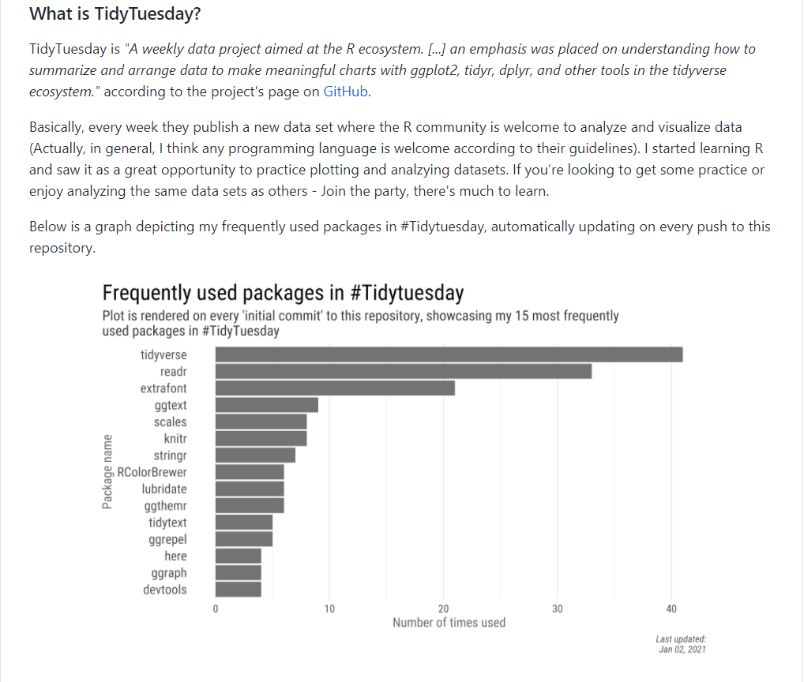

```{r setup, include=FALSE}
knitr::opts_chunk$set(echo = TRUE, message = FALSE, warning = FALSE)
```


```{css, echo = FALSE}
newcaption {
  font-size: 0.9em;
  text-align: center;
}
```


<center>
<newcaption>Final outcome of a plot in my GitHub README automatically updating and rendering on a specific git commit.</newcaption>
</center>
<br>


**TL;DR**: In this post we setup the code for having a GitHub Action automatically update a plot. I start by showing step by step how I plot my most frequently used R packages for [#Tidytuesday](https://github.com/rfordatascience/tidytuesday), a weekly data project. However, I constantly add more information to that data every week I participate and will have to re-run the script to update the plot. For that purpose we turn to GitHub Actions and provide a workflow to run the R script on a specific Git commit. You can find a live example of the outcome in my [#TidyTuesday repository](https://github.com/AmitLevinson/TidyTuesday).

### Preface

Before we begin, I want to thank [Rami Krispin](https://ramikrispin.github.io/) and [Michael Dorman](https://geobgu.xyz/). I contacted Rami a while back asking for advice on working with GitHub Actions. Rami helped me solve several problems I had and saved me a lot of frustration. 

As to Michael, I thank him for the example I use in this blog post. A while back Michael posted in an Israeli R Facebook group a plot detailing [the packages he frequently used at that time](https://gist.github.com/michaeldorman/ad8d89136f03769105ccc6199a913f0b?fbclid=IwAR09u1WFD9YpKYb7nvezOKqGGZac3AuVWC7ogDItSv9sXXS0x2KpYxg3aU0). I found it a great starting point to learn more about automation by trying out GitHub Actions to update a plot with my frequently used packages in #TidyTuesday submissions.

Speaking of automation, let's dive in!


### Why automate?

To answer that let's start with understanding what GitHub Actions are. Taken from GitHub's website:

> Automate, customize, and execute your software development workflows right in your repository with GitHub Actions. You can discover, create, and share actions to perform any job you'd like, including CI/CD, and combine actions in a completely customized workflow.

Reading up on various things you can automate made me eager to try it out - **For example, automating a script to run every Sunday morning, sending an email, updating a dashboard hosted online, collecting data and more.** One example that I saw while working on this post was [Emil Hvitfeldt's](https://www.hvitfeldt.me/) awesome paletter [bot](https://twitter.com/BotPaletteer). A Twitter bot that automatically tweets color palette packages once a day.

<center>
`r blogdown::shortcode('tweet','1340376626853535745')` 
<newcaption>[Emil Hvitfeldt's](https://www.hvitfeldt.me/) Twitter bot tweeting color palettes once a day using GitHub Actions</newcaption>
</center>  

## My TidyTuesday packages

In this post I'll go through creating the infrastructure to automatically update a plot I present in my TidyTuesday GitHub README file. In short, [#Tidytuesday](https://github.com/rfordatascience/tidytuesday) is an awesome weekly data project where individuals analyze and visualize new data every week. I find it a terrific learning experience and try to participate when I can. 

Every TidyTuesday I open a new R session resulting in the creation of multiple R files, and more relevant to us, the packages we use each session. We can read the script of all our R code and see what plot do I frequently use. However, the project occurs each week, resulting in additional data and need to update the plot. Instead of me updating it every week, I thought why not automate the plotting work by using GitHub Actions.

Side note: if you just want to quickly visualize your #TidyTuesday code without any GitHub Actions, I highly recommend exploring [Georgis Karmanis](https://karaman.is/) [Tweet](https://twitter.com/geokaramanis/status/1334437358519902209) and code. There he used the `{textreadr}` package to do a lot of the heavy lifting reading in and cleaning the files we'll do below. 

### Reading the files

Michael's original plot is fantastic. However, what's a blog post without challenges and tears. Therefore I decided to re-write his R-code using purrr and other friends. Let's start by loading the packages and reading in the files:

```{r}
# For map iterations
library(purrr)
# Cleaning text
library(stringr)
# Data manipulation
library(dplyr)
# For plotting
library(ggplot2)
# Adding a font for the plot
library(extrafont)

# Ideally, use the here package and not complete paths
tt_path <- "C:/Users/amitl/R_code/tidytuesday"
files <- list.files(path = "C:/Users/amitl/R_code/tidytuesday", pattern = "\\.R$|.Rmd$", recursive = TRUE)
files <- files[!str_detect(files, "packages-plot.R")]
```

First and most important, I recommend using R projects and the [{here}](https://github.com/jennybc/here_here) package by [Jennifer Bryan](https://jennybryan.org/) for file management. The only reason I'm using a direct path is because when writing this post my R session assumes I'm within my website directory, making it a challenge to move between project roots[^1].

We started by listing all files ending in `.R` or `.Rmd` in that specific path, also searching through sub-folder using `recursive = TRUE`. I then filter the script I use to produce the plot, since I don't want to include it in the analysis.


[^1]: If you decide to automate this with GitHub Actions, be alert if file paths throw an error.

```{r}
head(files)
```

We now have the R scripts I used to produce my TidyTuesdays. Unfortunately, it also returns R scripts I opened but didn't completely follow through with the analysis. That is, sometimes I worked on a TidyTuesday but stopped and left it incomplete without producing a plot (shame on me). There's not that many of them and for the purpose of the post we'll leave them there. 

Before we dig in I want to get the names of the files. It's not required for the analysis, but I found in nicer to look at the packages used corresponding to where they came from.

```{r}
# Get names
file_names <- str_extract(files, '[^/]+(?=\\.)')

head(file_names)
```

Our original string was "`r files[1]`", and we wanted everything after the last `/` but before the period - "National Parks". We achieve this using the regular expression `[^/]+` and a positive look ahead `(?=\\.)`, capturing everything between the last backslash and a period. Voila, our final output of "`r file_names[1]`", my first #TidyTuesday R script.   

Next we read in the text from all the R scripts:

```{r}
tt_path <- paste0(tt_path, "\\/" ,files)
file_lines <- map(tt_path, readLines)

head(file_lines[[1]])
```

After creating a complete path of our scripts we iterated across them using `map` and the function `readLines`. You can read `map` as follows: Run function `readLines` on every element of vector `tt_path` (The vector containing our path to each `.R`/`.Rmd` script). For a better understanding of the `map` function and family I highly recommend exploring the [documentation](https://purrr.tidyverse.org/reference/map.html).  

### Cleaning

If my memory is correct, I mainly use functions either by loading the library through `library()` or reference specific argument with `library::`. We'll capture both options using some regex and return them as a dataframe:

```{r}
names(file_lines) <- file_names
file_packages <- map_dfr(file_lines, ~ tibble(package = str_extract(.x, "((?<=library\\().+(?=\\))|\\w+(?=::))")),
  .id = "tidytuesday") %>% 
  filter(!is.na(package)) %>% 
  distinct(tidytuesday, package)

head(file_packages)
```

Perfect! First I added the original script names for each sub list within the `file_lines`. As to the analysis Let's tackle each element at a time from the inside out, starting with the regular expressions.

We can split the regex into two parts. the first one `(?<=library\\()).+(?=\\())` is both a positive look behind capturing everything after `library\\(` until it reaches `(?=\\))`, a positive look ahead for a parentheses. That way we capture everything in between the parentheses but remove the string `library()`. The second section of the regex `\\w+(?=::))` mimics the previous one but this time only with a positive look ahead -- Capture the word (`\\w+`) before the two `::`. 

We iterate the `str_extract` across each sub-list of the `file_lines` object using `map_dfr` to return a tibble. Since it returns a tibble, a variant of a data frame, we can assign the new vector a column name - `package`. In addition, `map_df*` (map_df, map_dfr, etc.) can take an `.id` argument that will return the names of the original sub-lists as a column, in our case the names of our files we earlier cleaned. After filtering any `NA` values such as empty lines, I used `distinct` to remove duplicate called packages in each week. For example, if I called `stringr::` twice in an R script I only want to count it once per session. 

### plot

We're at the last part of reading-processing-plotting journey. The plot is pretty straight forward -- we count the frequency of packages, relevel them by a descending order, take the top 15 frequently used and plot it as a bar plot.

If you decide to try another plot remember that you want it to automatically update, so make sure you create something that won't require you to constantly return to the code for editing.

```{r fig.show = 'hold'}
# Uncomment if you use it in a GitHub Action
# library(showtext)
# font_add_google("Roboto Condensed", "Roboto")
# showtext_auto()

file_packages %>% 
  count(package, sort = T) %>%
  mutate(package = factor(package, levels = rev(package))) %>% 
  slice(1:15) %>% 
  ggplot()+
  geom_col(aes(y= package, x = n), fill = "gray45")+
  labs(title = "Frequently used packages in #Tidytuesday",
       subtitle = "Plot is rendered on every 'initial commit' to this repository, showing my 15 most frequently\nused packages in #TidyTuesday",
       x = "Number of times used", y = "Package name",
       caption = paste0("Total scripts: ", length(file_names),
                        "\nLast updated:",format(Sys.Date(), "%b %d, %Y")))+
  theme_minimal()+
  theme(
    text = element_text(family = "Roboto Condensed"),
    plot.title = element_text(size = 18),
    plot.title.position = "plot",
    plot.subtitle = element_text(size = 11, color = "gray20"),
    plot.caption = element_text(size = 8, color = "gray30", face = "italic"),
    axis.title = element_text(color = "gray40", size = 9),   
    axis.text.x = element_text(size = 10),
    axis.text.y = element_text(size = 11),
    panel.grid.major.y = element_blank(),
    plot.margin = unit(c(4,2,2,4), "mm")
  )

# Save somewhere you'll reference later
# ggsave ("extra/packages-used.png")
```

A few specific things to note:  

1. In the GitHub Action I use [`showtext`](https://github.com/yixuan/showtext) as it enables to load a font that's not currently installed on the computer. You might need to play around with the text size if you use this package, as the appearance of graphs might vary across operating systems. Here I used the`{extrafont}` package since for some reason showtext wasn't properly rendering for me in this blog post.

2. In the caption I added two additional pieces of information we can insert to take advantage of the automation. The First part is the number of scripts used to produce the plot (`file_names`) when the Action ran. Second, the caption adds the current date on every render, i.e. every time we push to our #TidyTuesday repository and activate the GitHub Action.

An issue that's left is when calling `tidyverse` essentially we load packages such as `readr`, `ggplot2`, etc. We see that `readr` dominates the plot of packages because I call it explicitly when loading the data, compared to ggplot2 that I only load using `tidyverse`. So do I want to leave `readr` or remove it if I already load it with the `tidyverse`? Here I leave it as is, but let me know if you decided to tackle it (One option was parsing all scripts and seeing which package is used, but that can take a good while).

## GitHub Actions

*See additional learning resources below*


GitHub actions provide an easy way to automate various *workflows*. We provide GitHub a set of instructions on when to run the Action, and what exactly does it need to do. Instructions are aggregated as a script, in our case a 'YAML' file (Yet Another Markdown Language) with specific commands[^3].

[^3]: For the purpose of this post, and if you don't use GitHub Actions frequently, you should be good with the free plan (default unless you subscribed). In any case, you can read more about the plans [here](https://docs.github.com/en/free-pro-team@latest/github/setting-up-and-managing-billing-and-payments-on-github/about-billing-for-github-actions)). 

We have our plot showcasing our most frequently used packages, but we want it rendered for us on every participation in #TidyTuesday. That's exactly where GitHub Actions can help us by running the script for us. **We setup the code once, like we did before, and have our workflow run it when we choose.**

### Action Setup 

We'll use the `usethis` R package to create the Action workflow. The package makes it easy to work with GitHub Actions by providing great `yaml` templates and folder setups for various occasions. I found the `README` template adequate so we'll create that. Assuming you have the package installed, just type the following in the r console in the root folder of your Tidytuesday repository (or whatever repository you want the Action to run on):  


```{r eval = FALSE}
usethis::use_github_action()
```

And you should receive the following output, only with your information instead:

```{yaml, eval = FALSE}
√ Setting active project to 'C:/Users/amitl/R_code/TidyTuesday'
√ Creating '.github/'
√ Adding '^\\.github$' to '.Rbuildignore'
√ Adding '*.html' to '.github/.gitignore'
√ Creating '.github/workflows/'
√ Writing '.github/workflows/R-CMD-check.yaml'
* Copy and paste the following lines into 'C:/Users/amitl/R_code/TidyTuesday/README.md':
  <!-- badges: start -->
  [](https://github.com/AmitLevinson/TidyTuesday/actions)
  <!-- badges: end -->
```

Perfect. We're not going to copy the lines suggested as they're helpful for package checks, and we're only interested in producing a plot. The important outcome for us from running the line is the newly produced output under `./github/workflows/R-CMD-check.yaml`. We're going to use that yaml file to write up what we want GitHub to do.  

Feel free to rename the *worflow* file; as long as it's a `yaml` file under `/.github/workflows` GitHub will process it as an Action automatically. No further setup is needed, unless you need to use ['secretes'](https://docs.github.com/en/free-pro-team@latest/actions/learn-github-actions/security-hardening-for-github-actions#using-secrets), e.g. for confidential API keys.

Below are the instructions we implement in our yaml file:

```{yaml, eval = FALSE}
name: Render library update

on: [push]

jobs:
  build:
    runs-on: macOS-latest
    if: "contains(github.event.head_commit.message, 'initial commit')"
    steps:
      - uses: actions/checkout@v2
      - uses: r-lib/actions/setup-r@v1
      - name: Install packages
        run:
          Rscript -e "install.packages(c('tidyverse', 'showtext'))"
      - name: Render r plot file
        run:
          Rscript -e "source('extra/packages-plot.R')"
      - name: Commit results
        run: |
          git config --local user.email "actions@github.com"
          git config --local user.name "GitHub Actions"
          git add extra/packages-used.png
          git commit -m 'Re-build package plot' || echo "No changes to commit"
          git push origin || echo "No changes to commit"
```

### What's all this yaml

Let's break break up the script piece by piece:

* `name: Render library update` - The name of the the GitHub Action. This is what will appear under the workflows section in the GitHub actions tab.

* `on: [push]` - Tells GitHub when to activate the workflow. There's a plethora of options to use here; for example, you can have it run on every commit, a pull request or both. In addition, you can have it run at a specific time frame using `schedule`.

* `jobs: build:` - I'm not sure what exactly they do. I know that for rendering README files you'd have `render` instead of build, but honestly I don't know what either does exactly.

* `runs-on: macOS-latest` This tells GitHub on which operating system to run the r environment. You can also choose to run the action on several OS such as Ubuntu and Windows. It can be extremely useful when you're checking out packages and want to verify they work on various operating systems. I use on my own computer Windows and left it with `macOS-latest`.

* `if: "contains(github.event.head_commit.message, 'initial commit')"` - Here we provide GitHub an 'exit' option when running the Action, and the condition on when to run it. `github.event.head_commit.message` captures the commit message you used before pushing using a regex we provide - 'initial commit'. Without a logical condition, the Action will follow through on every push.

{}
We use a conditional statement to tell GitHub when to run our Action. If the condition returns true, in this case matching our commit message, GitHub Actions will complete the workflow. Otherwise the Action will stop and exit before processing the following steps. 
{}

* `steps...` - Telling GitHub the exact steps we want the action to do. The script starts with `uses` and then transitions between `name` and `run`.   
`uses` tells GitHub what to use: In the first one, [`actions/checkout@v2`](https://github.com/actions/checkout), GitHub checks out our repository on which the workflow will run. Next we set up a [remote r environment](https://github.com/jimhester/setup-r) using the `r-lib/actions/setup-r@v1` argument.  

* In the following steps we provide a name for the step and the actual code. In the first step we install the packages we'll be using and in the next one we `source` the R code that produces our plot[^2], located in my 'extra' folder in the repository. Lastly we provide Git commands in which we config the built-in token (to run the git commands), add our rendered plot, commit and push the results. 

[^2]: The more dependencies you have, the more susceptible your code is to breaking, e.g. if a function was deprecated. If you're concern you can use less depdencies than I have.

That's it! Just upload the newly edited files, and activate the Action with the specific commit. **Don't forget to reference the plot from your repository's README so it shows up.** If you're not sure how you can see how I did it [here](https://raw.githubusercontent.com/AmitLevinson/TidyTuesday/master/README.md).

```{r, echo = FALSE, fig.cap='The different steps the Action does when activated', fig.align='center'}
knitr::include_graphics("success.png") #
```


When the Action is running you will see an orange dot at the top of the root folder of your repository. Once it's complete it should turn green if all went well, or red if not. After it finishes give it a few minutes as it might take some time until the plot is actually updated. You can explore this action in [my #Tidytuesday repository](https://github.com/AmitLevinson/TidyTuesday).  

{}
If the above GitHub Action follows through with the workflow and produces a new plot, it will only be updated in your remote repository. You might be required to merge the remote content locally next time you want to push.
{}

In order to debug, for example if the orange dot turn to a red x, go into the 'Actions' tab in your repository, click on 'Render library update' or however you called the action <i class="fas fa-arrow-right"></i> click on the last commit message <i class="fas fa-arrow-right"></i> 'build' and then you should see a list of actions GitHub took. Try to identify where it stopped by locating the red x it marked the break with. Unfortunately debugging is a post in and of itself, and I'm currently not the one to write it.

**Disabling:** If you wish to disable the GitHub Action, you can either remove the `.yaml` file or disable the action from the repository's settings.

```{r echo = FALSE, fig.cap='Final outcome of a plot automatically updating in our README file.'}

```

### Closing remarks

This was my first time using GitHub actions and hopefully not the last. I used here only one example, and might be a little niche for some people, but I hope you got the big picture -- GitHub Actions are easy to use, and they can automate a lot of your work. Do let me know if you made an Action as a result of reading the post, I would love to see what you came up with.  

You can find the above example live in [my #TidyTuesday repository](https://github.com/AmitLevinson/TidyTuesday), the complete R script I used [here](https://github.com/AmitLevinson/TidyTuesday/blob/master/packages-plot.R), and the YAML script for the GitHub Action [here](https://github.com/AmitLevinson/TidyTuesday/blob/master/.github/workflows/render-plot.yaml). 

Lastly, I would like to highlight several resources I found extremely useful for learning more about GitHub Actions:

1. Jim Hester's [rstudio talk](https://www.jimhester.com/talk/2020-rsc-github-actions/) on GitHub actions - Great introduction and to get you excited about the opportunities available with GitHub Actions.  

2. Gavin Simpson's blog post ['Rendering your README with GitHub Actions'](https://fromthebottomoftheheap.net/2020/04/30/rendering-your-readme-with-github-actions/) - A more hands-on approach on setting everything up, learning about the `yaml` commands and implementing it in a README file.  

3. As I was finalizing this blog post I noticed Simon Couch published a fantastic blog post on using [GitHub actions to run an R script on a schedule](https://blog.simonpcouch.com/blog/r-github-actions-commit/). 

That's it for now. Hope you enjoyed this blog post and found it useful!