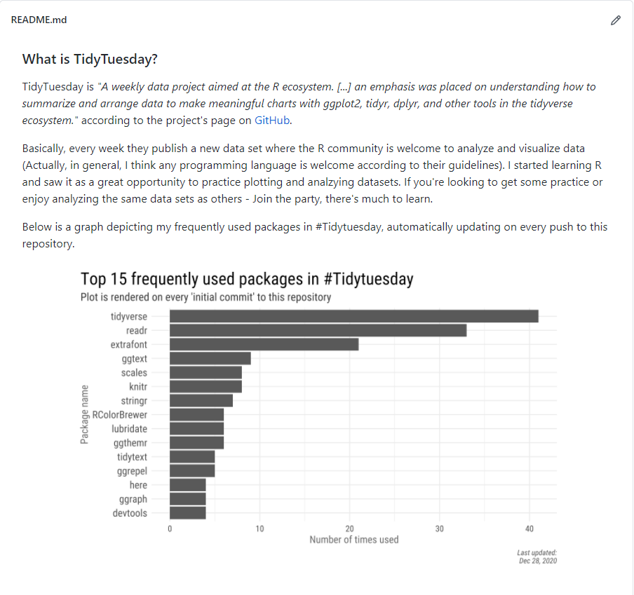

```{r setup, include=FALSE}
knitr::opts_chunk$set(echo = TRUE, message = FALSE, warning = FALSE)
```


```{r, echo = FALSE, fig.cap='Final output of an automatically updating plot rendered on a specific commit to a GitHub repository.'}
knitr::include_graphics("plot.png")
```

### Preface

Before we begin, I want to thank [Rami Krispin](https://ramikrispin.github.io/) and [Michael Dorman](https://geobgu.xyz/). I contacted Rami a while back when I wanted to learn more about GitHub Actions and asked for adivce. Rami reassured me that it wasn't difficult to learn and was forthcoming in helping if any problems arose, which they did and he saved me a lot of frustration.

As to Michael, I thank him for the example I use in the post to try out GitHub Actions. A while back Michael posted in an Israeli R Facebook group a plot detailing the packages he frequently uses ([Here's](https://gist.github.com/michaeldorman/ad8d89136f03769105ccc6199a913f0b?fbclid=IwAR09u1WFD9YpKYb7nvezOKqGGZac3AuVWC7ogDItSv9sXXS0x2KpYxg3aU0) a gist with the script). When thinking of how to try out GitHub actions I thought replicating it would be a great example, only adding an automation as a twist. 

Speaking of automation, let's dive in!


#### Why automate?

To answer that let's start with understanding what GitHub Actions are. Taken from GitHub's website:

> Automate, customize, and execute your software development workflows right in your repository with GitHub Actions. You can discover, create, and share actions to perform any job you'd like, including CI/CD, and combine actions in a completely customized workflow.

I first heard about GitHub Actions in regards to package checks, enabling package developers to run continuous integrations, unit tests and the like automatically. **One can have GitHub run a script built on a given Git action (e.g. a push or pull request), or at a specific time slot in the day\\week\\month.** For the purpose of this postת and if you don't use GitHub Actions frequently, you should be good with the free plan (default unless you subscribed). In any case, you can read more about the plans [here](https://docs.github.com/en/free-pro-team@latest/github/setting-up-and-managing-billing-and-payments-on-github/about-billing-for-github-actions)).

Reading up on various things you can automate made me eager to try it out - **Automating a script to run every Sunday morning, sending an email, and so much more.**. Another example that got me motivated was [Emil Hvitfeldt's](https://www.hvitfeldt.me/) awesome paletter [bot](https://twitter.com/BotPaletteer). A Twitter bot that automatically tweets color palette packages once a day. **I constantly read about automation in R with functions, reports and the like, so why not take automating one step further?**

### Our example for today - TidyTuesday packages

In this post I'll go through creating the infrastructure to automatically updating a plot I present in a GitHub README file. Specifically, I'll have the plot show my top 15 frequently used packages in #TidyTuesday. In short, #Tidytuesday is an awesome weekly data project where individuals analyze and visualize new data every week. You can find more info on the [project's Github page](https://github.com/rfordatascience/tidytuesday), or [about how it helps me in my journey of learning R and data visualization](https://amitlevinson.com/post/my-year-in-r/).

My Tidytuesday repository provides a perfect opportunity for me to try a GitHub Action. I open a new R session for each new project, resulting in creation of multiple R files, and more relevant to us, the packages we used each session. **This is a specific example, but I hope you'll be able to see the bigger picture of this amazing automating resource and use it when the time comes.**


Side note: if you just want to visualize your #TidyTuesday libraries or `geoms` without any GitHub Actions, I highly recommend exploring [Georgis](https://karaman.is/) [Tweet](https://twitter.com/geokaramanis/status/1334437358519902209) and code from a while back. There he used the `{textreadr}` package which does a lot of the heavy lifting reading in and cleaning the files we'll do below. I came across his tweet after completing the analysis part here and decided to leave it as it helps me understand what happens 'under the hood'.


### Reading the files

Michael's original plot as an inspiration for the example to use with GitHub Actions is fantastic. However, what's a blog post without some challenges and tears; therefore, we'll replicate the same idea with a tidyverse approach (he originally did it with base R code).

```{r}
library(purrr)
library(stringr)
library(dplyr)
library(tidyr)
library(ggplot2)
library(forcats)
library(extrafont)

# Ideally, use the here package and not complete paths
tt_path <- "C:/Users/amitl/R_code/tidytuesday"
files <- list.files(path = "C:/Users/amitl/R_code/tidytuesday", pattern = "\\.R$|.Rmd$", recursive = TRUE)
files <- files[-length(files)]
```

First and most important, I recommend using R projects and the [{here}](https://github.com/jennybc/here_here) package by [Jennifer Bryan](https://jennybryan.org/) for file management. The only reason I'm using a direct path is because when writing this post my R session assumes I'm within my website directory, making it a challenge to move between project roots[^2]. The argument basically lists all files ending in `.R` or `.Rmd` in that specific path. The `recursive = TRUE` searches through any sub-folders for any matching patterns, reading them in too. 

[^2]: If you decide to automate this with GitHub Actions, be alert if file paths throw an error.

I also filter the last element of the vector because that's the code file I use to produce the plot in the GitHub Action. One can have the Action run on a `README.Rmd` file that renders markdown README instead. However, I found using the code in a README cluttering so decided to stick with a regular R file and call the outputted plot from the repository's README. If you wish to host the plot or a dashboard in a spearate html file, you can also see a different blog post of mine on [hosting interactive graphs online](https://amitlevinson.com/post/sharing-interactive-charts/), and render to that instead.

Let's look at what we have:  

```{r}
head(files)
```

We see the R scripts I used to produce my Tidytuesdays. Unfortunately, it also returns R scripts I opened but didn't completely follow through with the analysis. That is, sometimes I worked on a TidyTuesday but stopped and left it incomplete without producing a plot (shame on me). There's not that many of them and for the purpose of the exercise we'll leave them there. 

Before we dig in I want to get the names of the files. It's  not required for the analysis, but I found in nicer to look at the packages used corresponding to where they came from.

```{r}
# Get names
file_names <- str_extract(files, '[^/]+(?=\\.)')

head(file_names)
```

Our original string was "`r files[1]`", and we want everything after the last `/` - "National Parks.R". We can achieve this using `[^/]+` and a positive look ahead `(?=\\.)` to capture everything between the last backslash and a period. Voila, our final output of "`r file_names[1]`".   

Now we can read in the text from all these R scripts:

```{r}
tt_path <- paste0(tt_path, "\\/" ,files)
file_lines <- map(tt_path, readLines)

head(file_lines[[1]])
```

After creating a complete path of our scripts we iterated across them using `map` and the function `readLines`. Essentially, you can read `map` as follows: Run function `readLines` on every element of vector `tt_path` (The vector containing our path to each `.R`/`.Rmd` script). For a better understanding of the `map` function and family I highly recommend exploring the [documentation](https://purrr.tidyverse.org/reference/map.html).

As to our output, notice that the line breaks from the original code scripts are preserved. That means that every line represents a code that was run. If you call each *library* in a separate line (which I imagine is common), we can directly search each of them for those containing the word `library`.

### Cleaning

Now that we read all lines in let's extract the libraries we used. If my memory is correct, I mainly use functions either by loading the library through `library()` or reference specific argument with `library::`. We'll capture both and return them as a dataframe:

```{r}
names(file_lines) <- file_names
file_packages <- map_dfr(file_lines, ~ tibble(package = str_extract(.x, "((?<=library\\().+(?=\\))|\\w+(?=::))")),
  .id = "tidytuesday") %>% 
  filter(!is.na(package)) %>% 
  distinct(tidytuesday, package)

head(file_packages)
```

Perfect! First I added the original script names for each sub list within the `file_lines`. As to the analysis Let's tackle each element at a time from the inside out, starting with the regular expressions.

We can split the regex into two parts. the first one `(?<=library\\()).+(?=\\())` is both a positive look behind capturing everything after `library\\(` until it reaches `(?=\\))`, a positive look ahead for a parentheses. That way we capture everything in between the parentheses but remove `library()` text. The second section of the regex `\\w+(?=::))` mimics the previous one but this time only with a positive look ahead -- Capture the word (`\\w+`) before the two `::`. 

We iterate the `str_extract` across each sub-list of our `file_lines` object containing all our R scripts using `map_dfr` to return a tibble. Since it returns a a data frame format we can provide a column name - `package`. In addition, `map_df*` (map_df, map_dfr, etc.) can take an `.id` argument that will return the names of the original sub-lists as a column.

After filtering any `NA`, that is words that didn't match our regex such as empty lines, I used `distinct` to remove duplicate packages in each week. For example, if I called `stringr::` twice in an R script.  

An issue that's left is when calling `tidyverse` essentially we load packages such as `readr`, `ggplot2`, etc. We see that `readr` dominates the plot of packages because I call it explicitly when loading the data, compared to ggplot2 I only call from the `tidyverse`. So do I want to leave `readr` or remove it if I already call `tidyverse`? Here I leave it as is, but feel free to find a workaround it.

### plot

We're at the last part of reading-processing-plotting journey. The plot is pretty straight forward and I invite you to explore other plots if you wish to produce different outputs. Remember though that you want it to automatically update, so make sure you create something that won't throw any errors requiring you to constantly edit the code.

```{r}
# Uncomment if you use it in a GitHub Action
library(showtext)
font_add_google("Roboto Condensed", "Roboto")
showtext_auto()

file_packages %>% 
  count(package, sort = T) %>%
  slice(1:15) %>% 
  ggplot()+
  geom_col(aes(y= fct_reorder(package,n), x = n))+
  labs(title = "Top 15 frequently used packages in #Tidytuesday",
       subtitle = "Plot is rendered on every 'initial commit' to this repository",
       x = "Number of times used", y = "Package name",
       caption = paste0("Last updated:\n",format(Sys.Date(), "%b %d, %Y")))+
  theme_minimal()+
  theme(
    text = element_text(family = "Roboto Condensed"),
    plot.title = element_text(size = 20),
    plot.title.position = "plot",
    plot.subtitle = element_text(size = 13, color = "gray20"),
    plot.caption = element_text(color = "gray30", face = "italic"),
    axis.title = element_text(color = "gray40", size = 12),
    axis.text.x = element_text(size = 10),
    axis.text.y = element_text(size = 12),
    plot.margin = unit(c(4,2,2,4), "mm")
  )


# Save somewhere you'll reference later
# ggsave ("extra/packages-used.png")
```

A few things to note:  

1. I used `showtext` as it enables to load a font that's not currently installed on the computer. This will be beneficial for when we run the script through GitHub Actions that set up a remote R environment.

2. I decided to only take the top 15 frequently used packages. You can play around with it to find a number you like or one that properly fits.

3. I automated the caption to print the current date on every render, i.e. every time we push to our #TidyTuesday repository and activate the GitHub Action.


## GitHub Actions

This was my first time around using GitHub actions and hopefully not the last. I'm not too familiar with GitHub actions at the time of writing this so I'll start off by highlighting a few resources I found useful:

1. Jim Hester's [rstudio talk](https://www.jimhester.com/talk/2020-rsc-github-actions/) on GitHub actions - Great introduction and to get you excited about the opportunities available with GitHub Actions. 

2. Gavin Simpson's blog post ['Rendering your README with GitHub Actions'](https://fromthebottomoftheheap.net/2020/04/30/rendering-your-readme-with-github-actions/) - A more hands-on approach on setting everything up to learn more about the `yaml` we write.


To begin, make sure you have the `usethis` package installed. The package makes it extremely easy to work with GitHub Actions by providing great `yaml` templates and folder setups. We're going to create a `yaml` file that will contain the commands we want GitHub to run. I found `usethis` `README.Rmd` template adequate so we'll create that. Just type the following in the r console in the root folder of your #Tidytuesday repository (or whatever repository you want the Action to run on):  

```{r eval = FALSE}
usethis::use_github_action()
```

And you should get the following output, only with your information instead:

```{yaml, eval = FALSE}
√ Setting active project to 'C:/Users/amitl/R_code/TidyTuesday'
√ Creating '.github/'
√ Adding '^\\.github$' to '.Rbuildignore'
√ Adding '*.html' to '.github/.gitignore'
√ Creating '.github/workflows/'
√ Writing '.github/workflows/R-CMD-check.yaml'
* Copy and paste the following lines into 'C:/Users/amitl/R_code/TidyTuesday/README.md':
  <!-- badges: start -->
  [](https://github.com/AmitLevinson/TidyTuesday/actions)
  <!-- badges: end -->
```

Perfect. We're not going to copy the lines suggested as they're helpful for package checks, and we're only interested in producing a plot. The important outcome for us from running the line is the newly produced output under `./github/workflows/R-CMD-check.yaml`. We're going to use that YAML file to write up what we want GitHub to do.  

I will not go through what the file currently contains, due to lack of space and my knowledge of everything there. Instead I'll provide you with the script I used in the `.yaml` to run what we need and we'll go through that. You can just copy and paste it in and edit any information that's specific to you (e.g. the plot name and folder you save it in). Also, feel free to rename the file, as long as it's a `yaml` file under the `workflows` directory GitHub will process it as an Action automatically (no setup is needed, unless you use credentials).

```{yaml, eval = FALSE}
name: Render library update

on: [push]

jobs:
  build:
    runs-on: macOS-latest
    if: "contains(github.event.head_commit.message, 'initial commit')"
    steps:
      - uses: actions/checkout@v2
      - uses: r-lib/actions/setup-r@v1
      - name: Install packages
        run:
          Rscript -e "install.packages(c('tidyverse', 'showtext'))"
      - name: Render r plot file
        run:
          Rscript -e "source('packages-plot.R')"
      - name: Commit results
        run: |
          git config --local user.email "actions@github.com"
          git config --local user.name "GitHub Actions"
          git add extra/packages-used.png
          git commit -m 'Re-build package plot' || echo "No changes to commit"
          git push origin || echo "No changes to commit"
```

### What's all this yaml

Let's break up the above script piece by piece:

* `name: Render library update` - The name of the the GitHub action. This is what will appear under the workflows section in the GitHub actions tab.

* `on: [push]` - Tells GitHub when to activate the workflow. There's a plethora of options to use here; for example, you can have it run on every commit, a pull request or both. In addition, you can have it run at a specific time frame using `schedule`.

* `jobs: build:` - I'm not sure what exactly they do. I know that for rendering README files you'd have `render` instead of build, but honestly I don't know what either does exactly.

* `runs-on: macOS-latest` This tells GitHub on which operating system to run the r environment. Essentially you can even choose a few such as Ubuntu, Windows, etc. It can be extremely useful when you're checking out packages and want to verify they work on various operating systems. I use on my own computer windows, but `macOS-latest` works nonetheless.

* `if: "contains(github.event.head_commit.message, 'initial commit')"` - Here we provide GitHub an 'exit' condition when running the script, and the condition on when to run it. `github.event.head_commit.message` captures the commit message you used before pushing. We then check whether it matches a regex we provided, in this case 'initial commit'. If it matches then GitHub will run the action, otherwise it'll exit the action and not process your script.  
I implemented this because I didn't want GitHub to run the script on every push. I was wondering how to have the script run only on newly added  `.R` or `.Rmd` files and not also modifications of existing R files. But I found it a little too specific and decided to rely on a commit I commonly use when uploading a TidyTuesday output for the first time.

* `steps...` - Here we tell GitHub the exact steps we want the action to do. The script starts with `uses` and then transitions between `name` and `run`.   
`uses` tells GitHub what to use: In the first one, `actions/checkout@v2`, GitHub checks out a copy of our repository on which the workflow will run. We set the 'fetch-depth' to 2 so the Action collects the relevant info it needs from the repository (not sure exactly what, but with 1 won't suffice. You can read more about it [here](https://github.com/actions/checkout#usage)). Next we set up a remote r environment using the `r-lib/actions/setup-r@v1` argument (Again, read more about it [here])(https://github.com/r-lib/actions/tree/master/setup-r).  
In the following steps we provide a name for the step and the actual code. In the first step we install the packages we'll be using and in the next one we `source` the R code that produces our plot. Lastly we provide Git commands in which we add our rendered plot (notice that I save it in a sub-folder), commit and push the results. I'm not too sure about the 'user.email' and 'user.name' arguments so I left them as is.

That's it! 

```{r, echo = FALSE, fig.cap='Succesfull GitHub Action detailing the process, found under the Actions tab', fig.align='center'}
knitr::include_graphics("success.png")
```


When the action is running you will see an orange dot at the top of your repository's root folder. Once it's complete it should turn green if all went well, or red if not. After it finishes give it a few minutes as it might take some time until the plot is actually updated.  

**The GitHub Action produces a new plot in the remote repository, but not locally on your computer. Therefore you might be required to merge the first time you push following the Action using 'git pull'.**

In order to debug, e.g., the orange dot turn to a red x, go into the 'Actions' tab in your repository, click on 'Render library update' or however you called the action -> click on the last commit message -> 'build' and then you should see a list of actions GitHub took. Try to identify where it stopped by locating the red x it marked the break with. Unfortunately debugging is a post in and of itself, and I'm not definitely the one to write it.

**Disabling:** If you wish to disable the GitHub Action, you can either remove the `.yaml` file or disable the action from the repository's settings.

```{r echo = FALSE, fig.cap='our final outcome automatically updating in our README file.'}

```


### Closing remarks

So this was only one example, and might be a little niche for some people, but I hope you got the big picture -- GitHub Actions are easy to use, and they can automate a lot of your work. Do let me know if you made an Action, would love to see what you came up with!