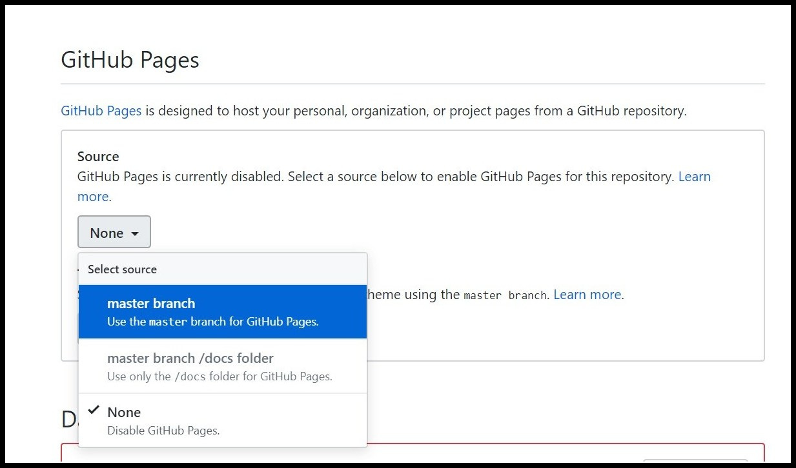

```{r setup, include=FALSE, warning=FALSE, message=FALSE}
knitr::opts_chunk$set(echo = TRUE, warning = FALSE, message = FALSE, fig.align = 'center')
```


### Background
A few weeks ago I gave my first talk about [analyzing and visualizing data in R](https://amitlevinson.com/talk/israel-2050/). I shared with participants - political activists - many of R's abilities, one of them creating 'interactive visulizations' which I very much like. I believe interactive graphs provide some edge to a static graph, of course when used properly. The first time I created an interactive graph for [#TidyTuesday](https://github.com/rfordatascience/tidytuesday), I was left with the question **how to provide others the ability to interact with it?**

### TL;DR

For those who already have a ready html file:  

1. Go into your github repository where the html file is located.  
2. On the top right click `Settings` <i class="fas fa-arrow-right"></i> Scroll down to `Github Pages` section <i class="fas fa-arrow-right"></i> instead of `none` choose `master branch`

That's it! You can now find your html widget under username.github.io/repo-name/file.html.  


### Why host it online?

- Sending html files with your new interactive graph can be cumbersome, especailly if it's a work in progress with updated versions you keep sending `r emo::ji("sad")`. Enough with those `html_4_final` names!

- You participated on [#Tidytuesday](https://github.com/rfordatascience/tidytuesday) and want to share your graph for others to explore themselves. In this case I recommend recording a gif or video where you interact with the graph and host it online for others to explore.

- Because once you set up your GitHub page up, it's just 2 more lines of code saving it as a file and pushing it to your repository.  

<a href="https://imgflip.com/i/3z9x4s"></a>


There are many useful tutorials for hosting slides and static files online that you can find [here](https://community.rstudio.com/t/deploy-xaringan-slides-to-github-pages/16459), [here](https://github.com/tcgriffith/xaringan_gh), and [here](https://annaken.github.io/hosting-revealjs-presentation-github-pages/). I found these very useful for hosting slides from the talk I gave and wanted to share that same tutorial aimed at hosting `html` graphs, technically the same file (html). The format is identical, but I remember when starting off with R I didn't know how. I was naive and just pushed my html file to GitHub thinking once it's there I can interact with it. Although it's pretty much that, we first need to turn our GitHub repository into a GitHub page.   

### Saving an html file

Saving an interactive plot - such as a {leafly}, {highcharter}, {plotly} or any other interactive object - can be done with various packages. Here I'll use the `{htmlwidgets}` package since it nicely fits the browser page, but of course you can try out others and see what suits you (for e.g. `{htmltools}`)

Let's take a #Tidytuesday dataset I used to create a `{highcharter}` map of median GDPR fines, where you can find the code for it [here](XXXX).

So, we have our map ready and can interact with it within R, as we can see in the gif below:

```{r fig.cap="Our interactive graph is all set on R, What's next?", out.width="80%"}
knitr::include_graphics("interactive-in-r.gif")
```


Now we want to save it on our computer. Make sure to save your graph into an object, let's say for this example our object is called 'hc_gdpr'. Before we save it using `htmlwidget::saveWidget`, we can define how the graph will render on an html page. If you'd like to adjust it's width and height parameters, you can add them to the html object which is saved as a list:

```{r eval = FALSE}
hc_gdpro$width <- "1400px"
hc_gdpro$width <- "700px"
```

And now we can write our file, when the `knitrOptions` takes our height and width configuration. Play around with it untill it satisfactory for you. Depends for what I need it but I found the default setting (seems like 100% width and height) adequate.

```{r eval = FALSE}
saveWidget(hc-gdpr, "hc-gdpr.html", selfcontained = TRUE, knitrOptions = list())
```


### GitHub pages

Great, we now have a new html file containing our graph saved in our working directory. If you open it up it should run smoothly, only notice it's doing so on your local copmuter. Next thing we want to do is host it online so others can interact with it too.  
We'll be hosting it on GitHub pages, so if you're not familiar with hosting your files to github through R I recommend following [happygitwithr](https://happygitwithr.com/) tutorial for getting your account set up.   
You can open a new repository for hosting your html files, but I think using the one where you host your source code is better. For example if it's a #Tidytuesday graph like mine, I just push it along with my `R` source code for that week. Make sure to include the html file, hosting only the code (.R / .Rmd) won't render it interactive; You can also host the html without the code.  

```{r, fig.cap="After writing your html object, push it to a Github repository"}
knitr::include_graphics("hosted.jpg")
```


Now that we have our file hosted we can assign our Github page: In the repository your html is hosted, click on `Settings` on the top right and scroll down until you reach the 'GitHub Pages' section. There you want to enable the GitHub pages by changing the deafult 'None' to `master-branch`.

```{r, fig.cap="Turn your Github repository into a Github page"}

```

That's it! you can find your hosted html file at `username.github.io/repo-name/file.html`

Of course once you have a GitHub page you can do so much more with it (personal website for e.g.), but that's for a different post altogether. If you want to learn more about adding a theme to GitHub pages check out [this post](https://resources.github.com/whitepapers/github-and-rstudio/).

Another option to host your html file would be on [Rpubs](https://rpubs.com/), but I find the GitHub page option more than adequate for my needs.


Enjoy!
