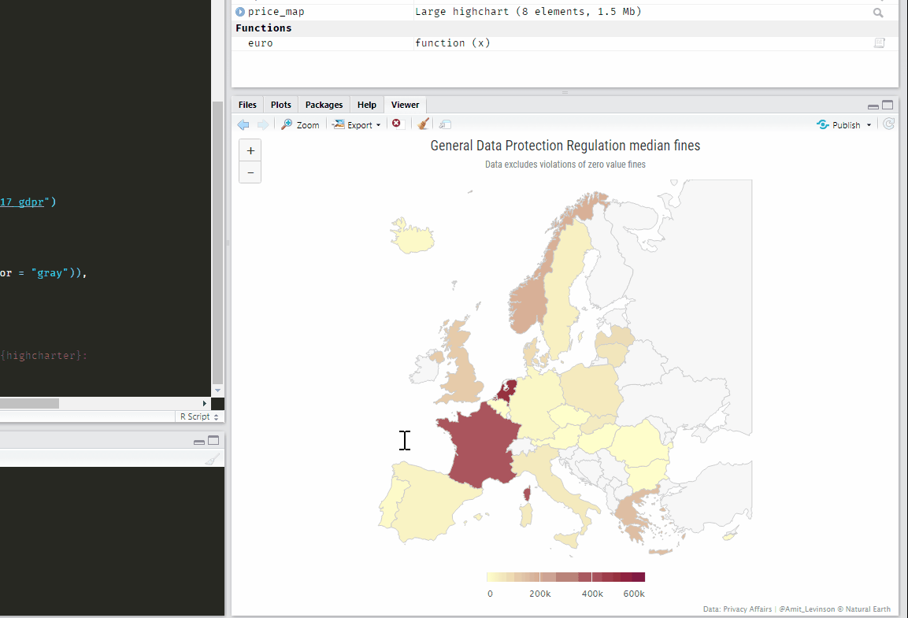

```{r setup, include=FALSE, warning=FALSE, message=FALSE}
knitr::opts_chunk$set(echo = TRUE, warning = FALSE, message = FALSE, fig.align = 'center', out.width = "80%")
```

<style>
p.caption {
  font-size: 0.8em;
}
</style>

```{r, fig.cap="No more sending html files - Host your interactive graphs online with GitHub pages", echo=FALSE, out.width = "80%"}
knitr::include_graphics("header.gif")
```


### Background

A few weeks ago I gave my first talk about [analyzing and visualizing data in R](https://amitlevinson.com/talk/israel-2050/). I shared with participants - political activists - many of R's abilities, one of them creating 'interactive visualizations' which I very much like. I believe interactive graphs provide some edge to a static graph when used appropriately. The first time I created an interactive graph was probably for [#TidyTuesday](https://github.com/rfordatascience/tidytuesday), which left me with the question **how to provide others the ability to interact with it?**  


### TL;DR

For those who already have a rendered html file:  

1. Push the rendered html file to GitHub repository.  
2. Go into your GitHub repository where the html file is located.  
3. On the top right click `Settings` <i class="fas fa-arrow-right"></i> Scroll down to `Github Pages` section <i class="fas fa-arrow-right"></i> instead of `none` choose `master branch`

That's it! You can now find your html widget under <span style="color:RoyalBlue;">username.GitHub.io/repo-name/file.html</span>    

### Why host it online?

- Sending html **files** of your new interactive graph can be cumbersome, especially if it's a work in progress with updated versions you keep sending. no more `html_4_final_final` kind of files - Seriously, not cool.

- You participated on [#Tidytuesday](https://github.com/rfordatascience/tidytuesday) and want to share your graph for others to explore themselves. In this case I recommend recording a gif or video where you interact with the graph and also host the file online for others to explore.

- Because once you set up your GitHub page up, it's just 2 more lines of code saving it as a file and pushing it to your repository.  

There are many great tutorials for hosting slides and static files online that you can find [here](https://community.rstudio.com/t/deploy-xaringan-slides-to-github-pages/16459), [here](https://github.com/tcgriffith/xaringan_gh), and [here](https://annaken.github.io/hosting-revealjs-presentation-github-pages/). I found these very useful for hosting slides from the talk I gave and wanted to share that same tutorial aimed at hosting `html` graphs, technically the same file (html). The format is identical, but I remember when starting off with R I didn't know how. I was naive and just pushed my html file to GitHub thinking once it's there I can interact with it. Although it's pretty much that, we first need to turn our GitHub repository into a GitHub page.   


<a href="https://imgflip.com/i/3z9x4s"></a>

### Saving an html file

Saving an interactive graph - such as a `{leafly}`, `{highcharter}`, `{plotly}` or any other interactive object - can be done with various packages. Here I'll use the `{htmlwidgets}` package since, in my opinion, its default settings nicely fit the browser page. You can also try out other packages and see what suits you (for e.g. `{htmltools}`).

Let's take a #Tidytuesday dataset I used to create a `{highcharter}` map of median GDPR fines. I won't be running through the code for creating the graph, but you can find it [here](https://github.com/AmitLevinson/TidyTuesday/blob/master/2020/week17_gdpr/gdpr.R) if you're interested in it.

We have our map ready and can interact with it **within R**, as we can see in the gif below:

```{r, echo = FALSE, fig.cap="Our interactive graph is all set in R, What's next?", out.width="80%"}

```

First, we want to render it into an html file. Make sure to save your graph into an object, let's say for this example our object is called 'hc_gdpr'. Before we save it using `htmlwidget::saveWidget`, we can define how the graph will render on the webpage. If you'd like to adjust it's width and height parameters, you can add them to the html object which is saved as a list, for e.g.:

```{r eval = FALSE}
hc_gdpro$width <- "1400px"
hc_gdpro$height <- "700px"
```

And now we can write our file to our current working directory. The `knitrOptions` takes our height and width configuration - Play around with it until it's satisfactory for you; depends for what I need it but I find the default settings - seems like 100% width and 100% height-  adequate for my needs:

```{r eval = FALSE}
saveWidget(hc-gdpr, "hc-gdpr.html", selfcontained = TRUE, knitrOptions = list())
```


### GitHub pages <i class="fab fa-github"></i>

Great, we now have a new html file containing our graph saved in our working directory. If you open it up it should run smoothly, only notice it's doing so on your local computer. If you send the file as is, it will work on someone else's computer if even if they don't have `R`. But what if we update our graph such as fix a typo? That's where hosting it online comes in. 

We'll be hosting the html file on GitHub pages, so if you're not familiar with Git or working with GitHub through R I recommend following [happygitwithr](https://happygitwithr.com/) tutorial for getting your account set up.   
You can open a new repository for hosting your html files, but I think using the one where you host your source code is better. For example, if it's a #Tidytuesday graph like the example here, I just push it along with my `R` source code for that week. Make sure to include the html file, hosting only the code file (.R / .Rmd) won't render it interactive; of course you can also host the html without the code (but hey, sharing is caring when it comes to open source).  

```{r, echo = FALSE, fig.cap="After writing your html object, push it to a GitHub repository"}
knitr::include_graphics("hosted.jpg")
```

Now that we have our file hosted we can assign our GitHub page: In the repository your html file is hosted, click on `Settings` on the top right and scroll down until you reach the 'GitHub Pages' section. There you want to enable the GitHub pages by changing the default 'None' to `master-branch`.

```{r, echo = FALSE, fig.cap="Turn your Github repository into a Github page"}
knitr::include_graphics("GitHub-pages.jpg")
```

**That's it!**  
You can find your hosted html file at <span style="color:RoyalBlue;">username.github.io/repo-name/file.html</span>. For instance, the exmaple I used for this blogpost can be found here: [https://amitlevinson.github.io/TidyTuesday/2020/week17_gdpr/hc_gdpr.html](https://amitlevinson.github.io/TidyTuesday/2020/week17_gdpr/hc_gdpr.html)

Once you have a GitHub page you can do so much more with it (such as host a personal website), but that's for a different post altogether. If you want to learn more about adding a theme to GitHub pages check out [this post](https://resources.github.com/whitepapers/github-and-rstudio/) by GitHub.

Another option to host your html file would be on [Rpubs](https://rpubs.com/), but I find the GitHub page option more than adequate for my needs.


Enjoy!
