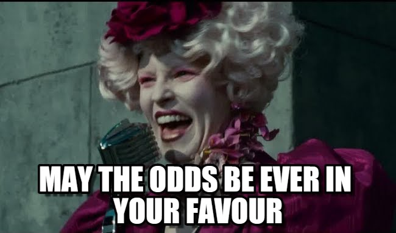

```{r setup, include=FALSE}
knitr::opts_chunk$set(echo = FALSE, message = FALSE)
```

> "I have a great idea to get rich. All we need is a lot of money." </br> ― A meme on the internet
                              
A while ago I was reading about Bernoulli trials and decided that I wanted to explore them further. I was wondering what would be an interesting case study for such a topic, and then it hit me (`r emo::ji("light_bulb")`): Why not explore lottery probabilities? Little did I know that this topic would lead me down the geometric distribution road and help me better understand the uncertainty in lotteries. In this blog post we'll learn about lottery probabilities and how to better understand the uncertainty of winning them using the geometric distribution.

```{r out.width="85%", out.height="85%"}

```


### The rules

We'll be exploring the probability of winning the Israeli lottery held by the [Pais organization](https://www.pais.co.il/), a well-known lottery enterprise in Israel. The ticket we'll be discussing costs is applicable to the main lottery called 'Loto' and costs 5.8 New Israeli Shekels (NIS), approximately ~1.6 dollars.  

Pais holds their lotteries twice a week with the regular prize of 5 million NIS, equivalent to $1,420,000. If there's no winner for a given week, the prize accumulates to the following lottery. For the sake of the post I'll only discuss winning a first place prize (be the only winner). In addition I won't be discussing the effect of prize increase on when to participate.  

When filling out a lottery form you choose 6 numbers in the range of 1&ndash;37 and a 'strong' number in the range of 1–7[^1]. In order to win first place you have to ~~get~~ guess correctly both the 6 number set and the strong number. Luckily, the order of the 6 numbers doesn't matter, and therefore if you wrote $6,12...n$ or $12,6,...n$ you're good on both (Also known as combinations, more on that in a minute).   

[^1]: An amusing anecdote is that the Pais organization offers information about 'Hot' numbers and the [frequency of appearance for each number](https://www.pais.co.il/lotto/statistics.aspx). Considering that the lottery is random I wouldn't rely on such a pattern... 

Another 'luck' in our favor is that in each lottery ticket we have the option to fill out two sets of numbers, thus doubling our odds of winning. I'm assuming we're on the same page and you won't use both of your attempts to guess the same sets of numbers, so that somewhat increases our odds of winning. Speaking of odds, let's have a look at them.

### The odds

To understand the lottery probabilities, we need to calculate **the probability of guessing a combination of 6 numbers out of 37 options along with one strong number out of 7 possible numbers.** In order to do this, we can turn to combinations:   

> In mathematics, a combination is a selection of items from a collection, such that (unlike permutations) the order of selection does not matter. </br> ― [Wikipedia](https://en.wikipedia.org/wiki/Combination)

That's exactly what we need. We want to calculate the probability of randomly guessing six numbers regardless of their order; If the order was important we'd want to look at permutations. In addition, each number is drawn without replacement, and therefore there can't be repetition of the same number.  

The formula to calculate combinations is as follows: $C(n,k) = \frac{n!}{k!(n-k)!}$ Where $n$ is the number of options to choose from and $k$ is the number of choices we make.   

Inputting our numbers we get $C(37,6) = \frac{37!}{6!(37-6)!}$, and now we just calculate away. However, don't forget we also need to guess another number out of 7 possible numbers (the strong one), so we'll multiply our outcome by $\frac1 7$, yielding a probability of $p = \frac{1}{16273488}$. 'Luckily' we choose two sets of numbers in a given ticket, so we multiply the probability by 2.

Therefore, the probability of winning the lottery is **$p = \frac{1}{8136744}$.**  

Wow! that's a very low probability. How low? Let's try and visualize it.

Sometimes when we receive a probability it's hard to grasp the odds and numbers thrown at us. Therefore, I'll try to visualize it for us. Imagine there's a pool filled with 8,136,744 balls. One of those balls is red and choosing that exact red ball blindly will win you the lottery:

```{r, fig.align='center', echo = TRUE}
library(ggplot2)
library(dplyr)
library(scattermore)
library(extrafont)
library(ggtext)

set.seed(123)

df_viz <- data.frame(x = rnorm(8136743, mean = 1000, sd = 1000),y = rnorm(8136743))
point_highlight <- data.frame(x = -1811.674, y = -2.268505588)

lot_p <- ggplot()+
  geom_scattermost(df_viz, pointsize = 0.1, pixels = c(2000,2000))+
  geom_point(data = point_highlight, aes(x = x, y = y), size = 0.3, color = "red")+
  annotate(geom = "curve", x = -2750, xend = -1860, y = -3.10, yend = -2.29,
    curvature = -.2, color = "grey25", size = 0.75, arrow = arrow(length = unit(1.5, "mm")))+
  annotate("text" ,x = -2750, y = -3.30, label = "Winner", family = "Roboto Condensed", size = 3)+
  labs(title = "Winning the Israeli lottery", subtitle = "To win, imagine trying to randomly choose a <b><span style='color:red'>specific ball</span></b> out of 8,136,744 balls")+
  theme_void()+
  theme(text = element_text(family = "Roboto Condensed"),
        plot.title.position = "plot",
        plot.title = element_text(size = 16, face= "bold"),
        plot.subtitle = element_markdown(family = "Roboto Condensed",size = 12),
        plot.margin = margin(4,2,2,4, unit = "mm"))

lot_p
```

Not easy is it?

Now that we know the probability of winning at each attempt, let's see how it manifests across multiple attempts.

### Multiple attempts - Geometric distribution

A Bernoulli trial is a random experiment with exactly two outcomes - such as success\\failure, heads\\tails - in which the probability for each outcome is the same every time [(Wikipedia)](https://en.wikipedia.org/wiki/Bernoulli_trial). This sets the ground for discussing an outcome of a lottery in which you either win or lose.

But we want to learn more about the *distribution of attempts*, and this brings us to the geometric distribution. A [Geometric distribution](https://en.wikipedia.org/wiki/Geometric_distribution) enables us to calculate the probability distribution of a number of failures before the first success[^2].

[^2]: In this blog post I only explore one aspect of the geometric PMF by looking at number of failures before the first success in a set of $k \in \{0 , 1, 2, ...\}$ attempts. To read more about the PMF I recommend starting with the Wikipedia page of the [Geometric distribution](https://en.wikipedia.org/wiki/Geometric_distribution).

Before we begin, we must meet several conditions to use the geometric distribution:  

`r emo::ji("heavy_check_mark")` Each trial is independent from one another - succeeding in one trial doesn't affect the next trial. We know this is true since winning in one lottery won't affect your chances of winning the next round.  

`r emo::ji("heavy_check_mark")` Every trial has an outcome of a success or failure. This assumption is true in our case where each lottery you participate in you either win or lose.

`r emo::ji("heavy_check_mark")` The probability of success $p$ is the same every trial - This is also true given the lottery probabilities are consistent across each game.

Now that we got the technicalities out of the way we can start exploring some of the uncertainty surrounding the lottery.  

#### Winning **at** a given trial

We can denote the probability of winning as $p$, which in the case of a lottery game is equal to $p = \frac{1}{8136744}$. What if we wanted to know the probability of winning the lottery on the third try? That means we need two failures and then a success. If the probability of success - guessing the correct numbers - is $p = \frac{1}{8136744}$, so the probability of a failure is $q = 1 - p$, in this case $q = \frac{8136743}{8136744}$. In order to win the lottery on the third try, this means getting two failures and then a success, resulting in a total of $k = 3$ attempts. Thus, the probability of winning on the third attempt is as follows:  

$p(3) = (\frac{8136743}{8136744})\cdot(\frac{8136743}{8136744})\cdot(\frac{1}{8136744})$, equaling $p = 0.0000001228993$. In other words there's a ~0.0000123% chance we'll win the lottery *exactly* on the third try.  

**Generalizing, the probability distribution of the number of Bernoulli trials needed to get one success on the $k$ th trial is: $P(X = k) = (1 - p)^{(k-1)} \cdot p$.** We can break this up according to our previous example:   

* $P$ stands for the probability of getting our value $X$ on the $k$ attempt. Meaning, we want to win the lottery only on the third attempt.   

* So our first two attempts should be a failure, thus a probability of $q = 1 - \frac{1}{8136744}$  multiplied by two (two rounds of failures), written as $(\frac{8136743}{8136744})^{3 - 1}$.  

* Lastly, $p$ stands for the probability of succeeding, $\frac{1}{8136744}$ occurring exactly on the $k$ attempt.

The probability we just discussed is also known as the probability mass function (PMF) of the geometric distribution. PMF is a function that gives the probability that a random discrete variable is exactly equal to some value. In our above example, the probability that we'll win exactly on the third try.


#### Winning **by** a given trial

We don't necessarily want to win the lottery on on a specific $X$ attempt, but explore the probabilities of winning *by* the $k$th attempt. Reframing our previous question we can ask **"what is the probability of winning the lottery on at least one of the first 3 attempts?"**, bringing us to the Cumulative distribution function (CDF). In a cumulative distribution we calculate the probability that $X$ will take a value less than or equal to $k$ (in our case representing the number of attempts).   

**How does this question change our calculation?**  

Let's assume we're still talking about 3 attempts. Our new framed question means we want to win the lottery either on the first attempt, the second or the third. In other words, we want to add the probability of success when $P(X = 1)$ + $P(X = 2)$ + $P(X = 3)$. Given that our probability of failure is $q = 1 - p$, we can write the argument as follows: $P(X \leq 3) = q^0\cdot p + q^1 \cdot p + q^2 \cdot p$, inputting our values of ${(\frac{8136743}{8136744}})^0 \cdot p \cdot({\frac{8136743}{8136744}})^1\cdot p, ...$, resulting in the probability of winning in one of the first three attempts $P(X \leq 3) = 0.000000368$, also written as a 0.0000368% chance.

But if we want to look at the first 50 attempts? we'll have to sum each individual PMF?

Here's exactly the use of the geometric CDF written as $P(X <= x) = 1 - q^x$. We raise the probability of losing to the power of attempts to win by and deduct it from 1, resulting in the probability of winning by a given trial.

### Winning on the first X trials

We just looked at the probability of winning on the first 3 trials, and now that we learned about the CDF we can calculate the probability of winning on the first $x$ trials, for e.g. on the first 100, 1000 and so on. In addition, another important factor we can take into account exploring the cumulative distribution is the money spent reaching each attempt.

We'll start by declaring our values. We know the probability for winning the lottery *with each ticket we have* is $p = \frac{1}{8,136,744}$ (remember, we get to choose two sets of numbers in each ticket), so let's declare that:

```{r echo = TRUE}
p <- 1/8136744
```

Next we know the probability for not winning is $q = 1 - p$:

```{r echo = TRUE}
q <- 1 - p
```

Now we can create a data frame to account for some 250,000 attempts. We don't need each attempt so we'll simulate data for the first 50,000 and then have points spread out in a 500 interval jump all the way to the 100,000,000 attempt.

```{r echo = TRUE}
df_prob <- tibble(trial = c(1:50000, seq(50000, 1e8, 500)))
```

Once we have that we can calculate both the probability of winning up to a specific attempt and the cumulative amount of money spent reaching there (according to a price ticket of NIS 5.8):

```{r echo = TRUE}
df_prob <- df_prob %>% 
  mutate(cdf = 1 - (q)^trial,
         money_spent = trial * 5.8)

head(df_prob)
```

Looks good!  

We see our top 6 observations with 3 columns we just defined (from left to right): the lottery raffle (trial), the probability of winning at a given trial until that point (cdf) and the money spent by that trial. Our probability of winning at *any* trial is constant ($p$), so it'll be redundant to add that in here.

Now let's look at specific points along our data frame and see how much money is spent reaching there. More specifically, let's look at the details of some attempts such as 1; 10; 100; 1000; 2500, 5000, $...$, 1,000,000, 10,000,000; 50,000,000:

```{r}
trials_we_want <- c(1,10,100,500,1000,2500,5000,10000,25000,100000,250000,500000,1000000,1e7, 5e7)
sample_trials <- df_prob %>% 
  filter(trial %in% trials_we_want)
```

```{r, out.width = "90%"}
library(gt)
library(scales)

df_sample <- sample_trials %>%
  mutate(attempt = number(trial, big.mark = ",", accuracy = 1),
         money_spent = money_spent/3.5,
         money_spent = dollar(money_spent),
         cdf_perc = percent(cdf)) %>% 
  select(-c(cdf, trial)) %>%
  relocate(attempt, everything())
  
  gt(df_sample) %>% 
  tab_header(
    title = html("<b><span style='font-family:Roboto Condensed'>Lottery probabilities with the geometric distribution</span></b>"),
    subtitle = html("<span style='font-family:Roboto Condensed'>Lottery probabilities winning by a given attempt, the money spent reaching there and your chances of winning by then</span>")) %>% 
  opt_align_table_header(align = "left") %>% 
  tab_options(heading.title.font.weight = "bold") %>% 
  cols_label(
    attempt = "Attempt",
    money_spent = "Money spent",
    cdf_perc = "% winning by then"
  ) %>% 
    tab_footnote (
    footnote = "Money spent (rounded up) corresponds to the cumulative number of attempts played",
    locations = cells_column_labels(
      columns = vars(money_spent)))
```


In the above table I printed specific observations along the lottery's cumulative geometric distribution. In our left column we have the trial number, next the approximate amount of money spent up to that trial and lastly the percent of winning by that given trial. Notice that I converted the New Israeli Shekels to dollars ($1 dollar = ~ NIS 3.5).   

If we played 100 consecutive games with the same number, we would spend 166 dollars by that point and have only a 0.00123% chance of winning. We only pass the 1% (!) chance of winning after buying more than 100,000 tickets, spending a total of $165,714 dollars.  
**To pass the 10% chance of winning you'd have to play 1,000,000 games and spend ~1,600,000 dollars! Reminder: the default prize is only some \$1,412,000!**

```{r out.height="80%"}
knitr::include_graphics("dumber.jpg")
```

### Average number of attempts

An interesting feature of the geometric distribution is that we can calculate the expected number of attempts and variance of the distribution. The expected number of attempts in the discussed geometric cumulative distribution is $E(X) = \frac{1}{p}$ with a variance of $var(X) = \frac{1-p}{p^2}$. $E(X)$ is basically the expected value for the number of independent trials needed to get the first success (Think of it as an average, only theoretically). So in our lottery example the expected number of attempts to reach a success is $E(X) = \frac{1}{\frac{1}{8136744}}$, resulting in 8,136,744 attempts.

R has built in functions for working with the geometric distribution such as `pgeom`, `rgeom`, `qgeom` and `dgeom` which you can explore more [here](https://www.statology.org/dgeom-pgeom-qgeom-rgeom-r/). For the purpose of exploring the mean we can use the `rgeom` function which generates a value representing the number of failures before a success occurred. For example, let's see how many failures we're required to reach one success:

```{r echo = TRUE}
rgeom(n = 1,p = p)
```

In the above example `rgeom` takes the number of rounds (n = 1) and the probability of winning (p = p). The outputted value indicates the number of failures before our success.  

Using this we can calculate the average number of attempts from 2,000,000 games:

```{r echo = TRUE}
mean(rgeom(2e6, p))
```

Pretty close to our expected value!  

So what does the $E(X)$ mean in terms of the lottery? **You'd have to play approximately 8,136,744 games to win the lottery, spending a total of NIS 47,193,115 (~&#36;13,483,747) to win approximately NIS 5M (approximately 1.42M dollars)!**

### Conclusion

In this post we were able to uncover and better understand some of the uncertainty that covers a lottery game. Using the geometric distribution we explored the probability of winning the lottery at a specific event, and winning it in the form of a cumulative distribution - Chances of winning up to a given trial.  

Unfortunately, the numbers aren't in our favor. You'd find yourself spending a great deal of money before actually winning the lottery. I'm definitely not going to tell you what to do with your money, but I hope this blog post helped you understand a little better the chances of (not) winning the lottery. But hey, apparently a [New Yorker won the lottery after participating each week for 25 years](https://www.businessinsider.com/powerball-lottery-playing-same-numbers-odds-of-winning-2018-11) so you never know.

### Further reading \\ exploring

Two resources I found extremely valuable in learning more about the geometric distribution:

- The [Geometric distribution Wikipedia's page](https://en.wikipedia.org/wiki/Geometric_distribution). I'm constantly amazed at the vast amount and well articulated statistical pages they have.  

- Continuing on that, I found the resource that the Wikipedia page relies on extremely helpful: "A modern introduction to probability and statistics : understanding why and how".

- If you're more of a video kind of person, I highly recommend a video by [The Organic Chemistry Tutor](https://www.youtube.com/channel/UCEWpbFLzoYGPfuWUMFPSaoA) about the [Geometric distribution](https://www.youtube.com/watch?v=d5iAWPnrH6w&t=1s). I think he does a superb job in explaining different various statistical analysis and always enjoys his videos.

### Notes