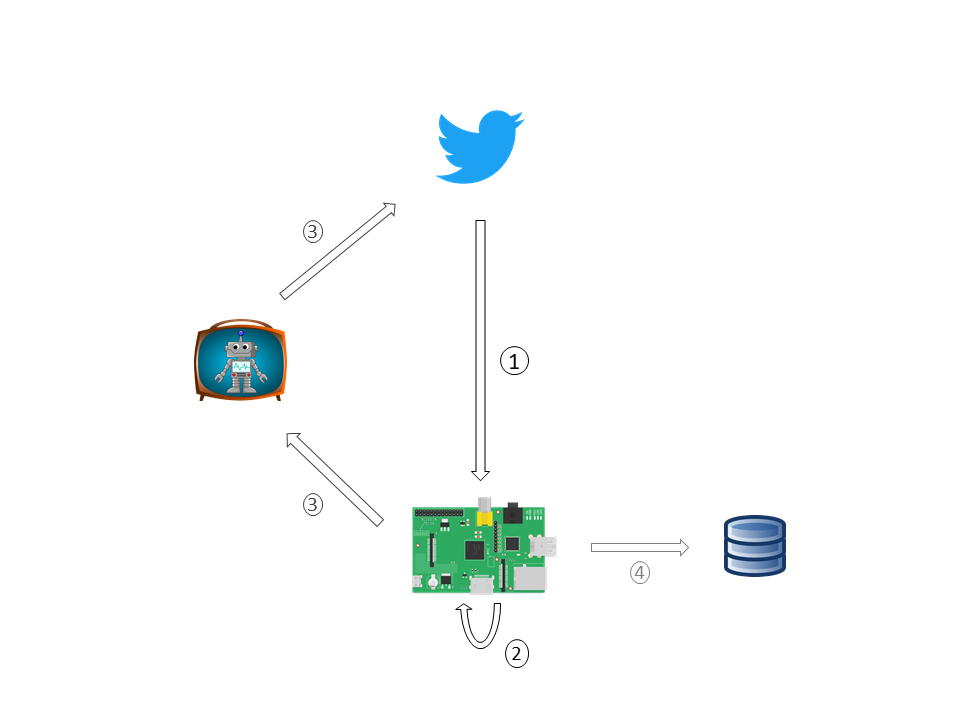
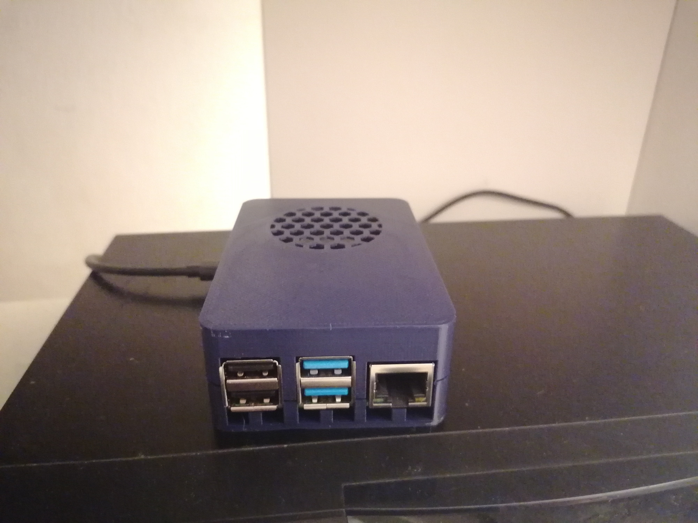

### Why the Pi

After some recent learning of [automating workflows with GitHub Actions](https://amitlevinson.com/blog/automated-plot-with-github-actions/), I wanted to take automating one step further. In January 2021 I bought myself a Raspberry Pi 4 (a small computer) and was pondering about what to do with it.

At the time Israel was preparing for its 4th consecutive election and I decided to create a corresponding Twitter bot that will operate on the Raspberry Pi. I use Twitter mainly to follow individuals that post about R and data visualization, and saw it a great opportunity to collect information about the elections so I can view it in one place.

### How it works

If you want a more technical overview checkout the [project's GitHub repository](https://github.com/AmitLevinson/israeli-elections-twitterbot). The figure below outlines the conceptual model of the entire process:

1. The Raspberry Pi runs an R script to **query Twitter every 10 minutes** for the hashtag '#בחירות' (#elections).

2. It then **filters any tweets** that don't meet a specific criteria (too many hashtags, tagged as spam, etc).

3. Once the data is filtered, the **Raspberry Pi posts the valid tweets back to Twitter** as retweets on behalf of the [@bchirot2021](https://twitter.com/bchirot2021) twitter account.

4. While this happens every 10 minutes, I also setup a MySQL database that updates every night at 11PM with the data.

After an initial setup the process ran automatically every 10 minutes. 

The R script is based on [Mike Mahoney's](https://www.mm218.dev/) neatly written [R script for setting up a Twitter bot](https://github.com/mikemahoney218/retweet_bot). I also used [Ran Bar-Zik's tutorials (in Hebrew) to setup the Raspberry Pi](https://internet-israel.com/category/%D7%9E%D7%93%D7%A8%D7%99%D7%9B%D7%99%D7%9D/raspberrypi/)

### Closing remarks

Although the bot didn't attract many followers it was a fun and challenging experience. I learned a lot about setting up a Linux system (Debian), working with shell scripts and crontabs, accessing a remote MySQL database and a lot of work with the command line interface.

The bot is now shutdown and the Pi is awaiting it's next adventure :smile:

<figcaption>
The Raspberry Pi (with a 3D printed case by a friend) sitting at home on top of my router.
</figcaption>