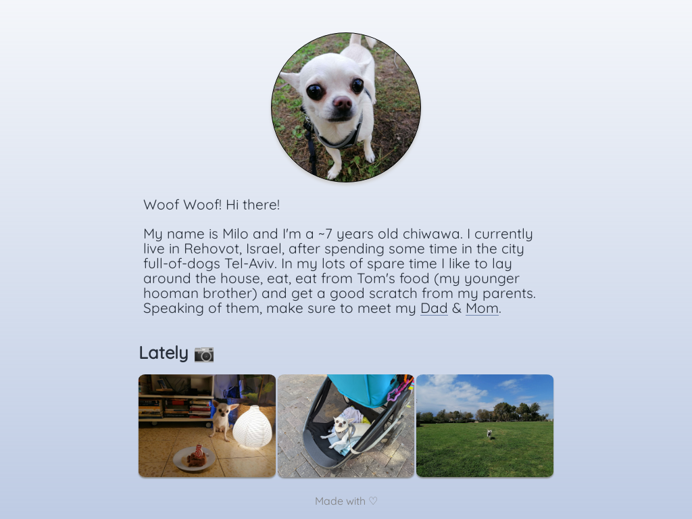
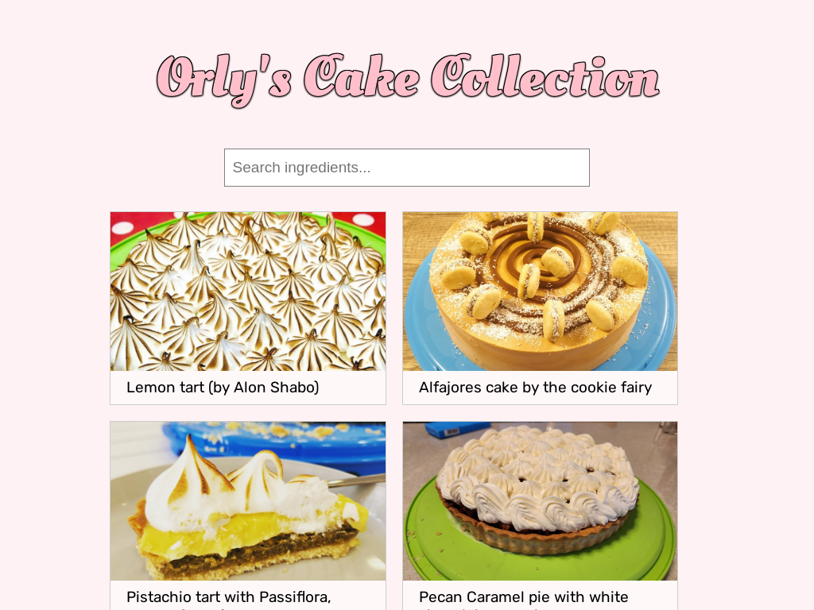

On various occasions I find myself wanting to learn web developement. Until I pick it up more seriously, here are two websites I built that I'm pretty fond of:

### Milo's website

A website I created for my dog.

**[milo-the-dog.amitgrinson.com](milo-the-dog.amitgrinson.com)**

### My Sister's Cake Collection

My sister makes lots of delicious cakes. When someone has an occasion the common question she raises is 'what cake would you like?'. This website is a good introduction to the various cakes she makes, in case she asks you and you're looking for inspiration :)

**[dr-cake.netlify.app](https://dr-cake.netlify.app/)**

