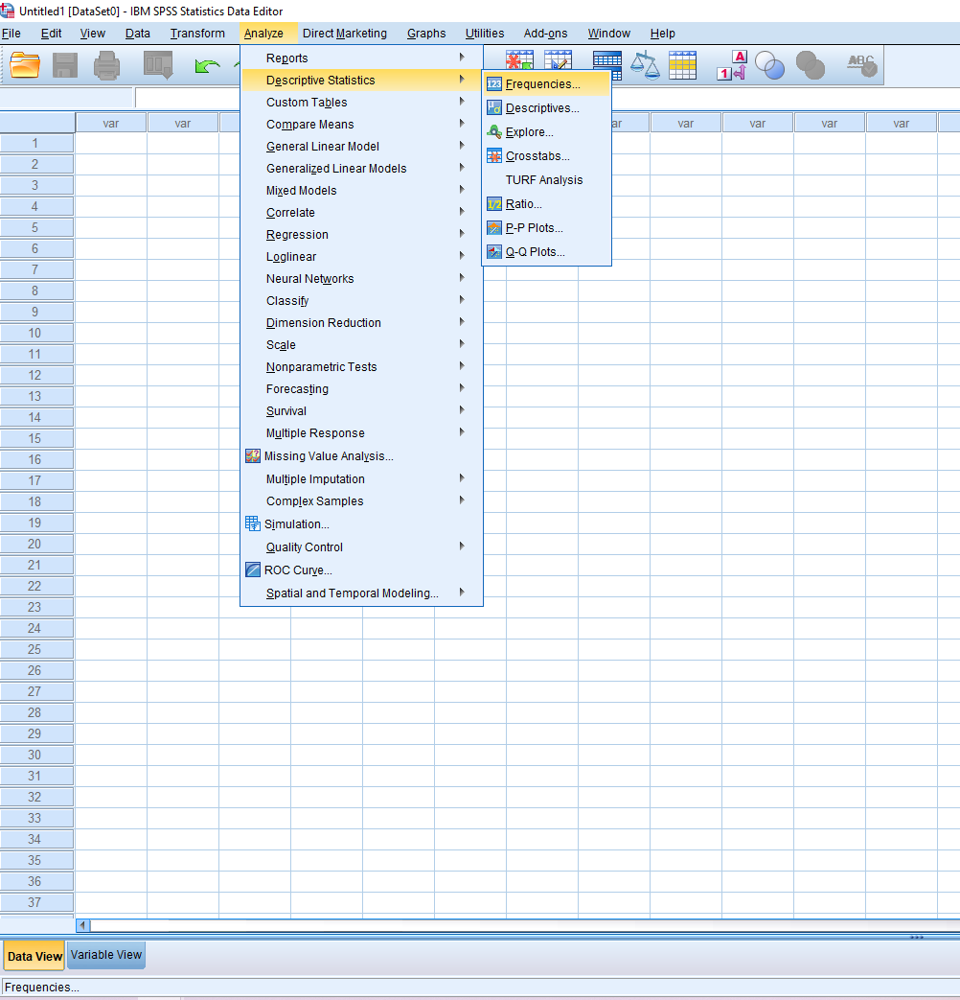
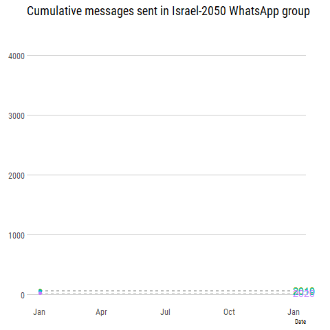

background-image: url(./img/title.png)
background-position: 100% 100%
background-size: 50%

class: left, bottom, title-slide
# Wrangling and Visualizing
# Data with R
.left[
`r icon::fa("twitter")` [.white[Amit_Levinson]](https://twitter.com/Amit_Levinson) <br>
`r icon::fa("github")` [.white[Amit_Levinson]](https://github.com/AmitLevinson) <br>
`r icon::fa("link")` [.white[amitlevinson.com]](https://amitlevinson.com/) <br>
]
```{r setup, include=FALSE}
options(htmltools.dir.version = FALSE, knitr.table.format = "html")
knitr::opts_chunk$set(warning = FALSE, message = FALSE, 
  dpi = 400, echo = FALSE, fig.align = "center", out.width = "80%", cache = FALSE, fig.height=4.5, fig.width=8)
options(digits = 2)
library(tidyverse)
library(tidytext)
library(knitr)
library(janitor)
library(plotly)
library(extrafont)
library(ggtext)
library(glue)
library(highcharter)
library(gapminder)
library(lubridate)
library(ggraph)
library(igraph)
```

```{r xaringan-themer, include=FALSE}
xaringanthemer::mono_accent(base_color ="#43418A",
                            code_font_family = "Fira Code",
                            code_font_url = "https://cdn.rawgit.com/tonsky/FiraCode/1.204/distr/fira_code.css")
```

---
class: left

# About **today**

.pull-left[

### We'll talk about

- SPSS: How *I* learned to work with data

- Some good alternatives

- R as a **recommended** alternative

  - What is R
  
  - Some cool plotting features

  - Why I fell in love `r emo::ji("heart")`
]
--
.pull-right[

### We won't talk about

- Which alternative is better


- Practical code


- coconut, we definitely won't talk about that (I mean who likes it? `r emo::ji("sick")`)
]
--

.left[.footnote[.tiny[Anything said is based on my personal views and experience working with R]]]


---

# About **me**

--

- Graduate student for Sociology & Anthropology

  - Thesis: Authenticating on Telegram when purchasing cannabis

--

- Research assistant for [Dr. Jeniffer Oser](https://www.jenniferoser.com/) researching online & offline political participation

--

- Participated in Israel-2050 in 2017 (second cohort)

--

- Political activist who likes to designate data as a way of advocacy

---
# About **SPSS**

> *Statistical Product and Service Solutions (SPSS) is a software package used for interactive, or batched, statistical analysis. ~ [Wikipedia page](https://en.wikipedia.org/wiki/SPSS)*

--
.pull-left[
## Pros

- Has a solid infrastructure (IBM)


- Many functions


- Our faculty uses it


- Knowledge of it is sometimes a demand in industry
]

--

.pull-right[

## Cons


- **Costs money**

- An **inefficient workflow**

- **It's not fun** to work with data in it

- Plots are nice (?), but you can **make nicer plots**.

- Its graphic user interface **(GUI) is overloaded**
]

---

## SPSS... remind me?

--



---
class: center
background-image: url("https://media.giphy.com/media/bWM2eWYfN3r20/giphy.gif")
background-size: 100% 100%

---
class: top, left

## Quick Alternatives

--

.pull-left[
### [Jamovi](https://www.jamovi.org/)


### [JASP](https://jasp-stats.org/)

]

--
.pull-right[
### [Tableu](https://www.tableau.com/)

<br>
<br>
<br>
### [Power BI](https://powerbi.microsoft.com/en-us/)

]

???

- Show how Jamovi/Jasp look like

---

## R is...

--

- A "software environment for **statistical computing and graphics**" [(r-project)](https://www.r-project.org/)<br>

--

- **Free** to use

--

- Open source

--

- Has an **amazing community**

--

.content-box-blue[
```{r echo = FALSE}
cowsay::say("Did you mean are?", "cow")
```
]

---

class: title-slide, middle, center, inverse

## Some of the basics

---

### Basics - Math operations

--

- You can do simple **calculations**:

```{r echo=TRUE}
1+3
```

--

```{r echo=TRUE}
4^3
```

--

Use objects to store vectors and operate on them:
```{r echo=TRUE}
x <- c(1:10)
```

--

```{r echo=TRUE}
mean(x)
```

---
### Basic - Reading text

+ It's easy to manipulate and work with **text**

--

+ We can use **reg**ular **exp**ressions (**regex**) to work out the magic

--

+ For e.g, imagine you want to extract any word that doesn't have a vowel:

--

> "**Why** this is some random text with some words that don't have vowels such as **myth**, **shy**, or **gym**"

--

+ We want to create an expression that captures everything **that isn't a vowel** and use that to filer:

--

```{r echo=TRUE}
words <- unlist(str_split("Why this is some random text with some words that don't have vowel such as myth, shy, or gym", boundary("word")))
grep("^[^aeiou]+$", x= words, value = TRUE) #<<
```

---

### Basics - Reading data

.footnote[.small[[*] Data from [Project datasets](https://perso.telecom-paristech.fr/eagan/class/igr204/datasets)]]

Read data from **online sources**<sup>*</sup>

```{r eval = FALSE, echo = TRUE}
countries <- read_delim("https://perso.telecom-paristech.fr/eagan/class/igr204/data/factbook.csv", delim = ";")
```

```{r echo = FALSE}
url <- "https://perso.telecom-paristech.fr/eagan/class/igr204/data/factbook.csv"
headers <- read_delim(url, delim =";") %>% colnames()
countries <- read_delim(url, delim = ";", skip = 2, col_names = headers) %>% 
  clean_names()
```

--

Let's have a look at our top 6 rows:

--

```{r echo = FALSE}
knitr::kable(countries[1:6,], format = "html") %>% 
  kableExtra::kable_styling(full_width = F) %>% 
 kableExtra::scroll_box(height = "300px")
```

---
### Basics - plot

R's simple plotting features:

```{r echo = TRUE}
ggplot(countries, aes(x = death_rate_deaths_1000_population, y= unemployment_rate_percent))+
  geom_smooth(method = "lm")+
  geom_point()+
  theme_minimal()
```

---
### Basics - reports

The **reproducible** and **automated** work flow makes it really easy to create reports and documents:

.pull-left[
For example this:
```markdown
"The lowest GDP per capita is 
`min(countries$gdp_per_capita)`
and the highest unemployment
rate is `max(countries$unemployment_rate).
The average birth rate for 1000
people is `mean(countries$birth_rate_birth_
births_1000_population, na.rm = T)`.
The correlation of unemployment and
GDP per capita is cor(
countries$gdp_per_capita,
countries$unemployment_rate,
"complete.obs").
```
]

--

.pull-right[

Will render this:  

"The lowest GDP per capita is **`r min(countries$gdp_per_capita, na.rm = T)`** and the highest unemployment rate is **`r max(countries$unemployment_rate_percent,na.rm = T)`**. The average birth rate for 1000 people is **`r mean(countries$birth_rate_births_1000_population, na.rm = T)`.** The correlation of unemployment and GDP per capita is **`r cor(countries$gdp_per_capita, countries$unemployment_rate_percent, "complete.obs")`**

.rotate-right[.center[
]]]

---

class: title-slide, center, middle, inverse
# Let's look at some .bolder[cool stuff]
# you can do with R

---
## Efficiency

--

### We can use code output inline our text

--

### No more <s>Copy+Paste</s> `r emo::ji("scared")`

--

### 'Print' documents in one click

--
.rotate-right[.pull-right[

]]

???
Show the report rendering

---
## Maps

- You can make some neat and easy maps in R

--

```{r echo = FALSE, out.width="100%"}
states <- map_data("state")
arrests <- USArrests %>% clean_names()
arrests$region <- tolower(rownames(USArrests))
df <- merge(states, arrests, sort = FALSE, by = "region")
df <- df[order(df$order),]

ggplot(df, aes(long, lat))+
  geom_polygon(aes(group = group, fill = rape))+
  coord_map("albers", lat0 = 45, lat1 = 39)+
  scale_fill_gradient(low = "white", high = "red", name = NULL)+
  ggtitle("Number of murder arrests per 100,000 people in U.S, 1975")+
  ggthemes::theme_map()+
  theme(
    legend.position = "bottom",
    plot.title = element_text(hjust = 0.5, family = "Roboto Condensed", size = 15))
```

---

## Interactive maps

--

- When missiles are fired towards Israel

--

- And your city has open data such as bomb shelter locations
--

- You can make an interactive map with locations of bomb shelters near you

--

```{r echo = FALSE, eval = FALSE}
library(leaflet)
leaf_map <- read_csv("data/shelters.csv") %>% 
leaflet() %>% 
  addTiles() %>% 
  setView(34.7913, 31.25181,zoom = 13) %>% 
  addCircles(radius = 4, color = "red", fill = TRUE)

htmltools::save_html(leaf_map, "lm.html")
```

<iframe src="lm.html" width = "80%" height="400" id="igraph" scrolling="no" seamless="seamless" frameBorder="0"></iframe>

---

## Interactive plots

Make interactive graphs with **{plotly}**

--

```{r echo = FALSE, eval = FALSE}
gapminder_2007 <- gapminder %>% 
  filter(year == 2007)

p <- ggplot(gapminder_2007, aes(x = lifeExp, y= gdpPercap))+
  geom_point(aes(text = paste("Country:", country), color = continent))+
  theme_classic()+
  labs(title = "Countries GDP per capita and life expectancy for 2007", y= "GDP per capita", x= "Life expectancy")+
  theme(text = element_text(family = "Roboto Condensed"),
        plot.title = element_text(size = 16),
        axis.ticks = element_blank(),
        axis.line = element_line(color = "gray90"))

plotly_fig <- plotly::ggplotly(p)
# htmltools::save_html(plotly_fig, "plotly.html")
```

<iframe src="plotly.html" width="100%" height="500" id="igraph" scrolling="no" seamless="seamless" frameBorder="0" </iframe>

---
<br>
<br>
Or with **{highcharter}**
```{r echo = FALSE, eval = FALSE}
gapminder_filter <- gapminder %>% 
  filter(country %in% c("Germany", "France", "Israel","Gabon", "Angola"))

hc1 <- gapminder_filter %>% 
  hchart(.,
         type = "line",
         hcaes(x = year,
               y = lifeExp,
               group = country)) %>% 
  hc_title(text = "Life expectancy for Germany, France, Israel, Gabon and Angola") %>% 
  hc_tooltip(pointFormat = 'Life expectancy: {point.y:.0f}') %>%
  hc_legend(enabled = TRUE) %>% 
  hc_add_theme(hc_theme_ffx())

htmltools::save_html(hc1, file = "hc1.html")
```

<iframe src="hc1.html" width="95%" height="500" id="igraph" scrolling="no" seamless="seamless" frameBorder="0"> </iframe>

---

## Animated plots

--
```{r echo = TRUE}
library(gganimate)
```

```{r include = FALSE}
Sys.setlocale("LC_ALL", "Hebrew")
```

--

Bonus: You can **export chat from *WhatsApp**:

--

```{r echo = TRUE}
chat_raw <- read_delim("chat.txt", delim = "-")
head(chat_raw)
```


--

```{r eval = FALSE, include=FALSE}
chat_raw <- read_delim("chat.txt", delim = "-")
chat <- chat_raw %>%
  setNames(c("date", "post","x1", "x2")) %>%
  filter(str_detect(date, "^[:digit:]{2}")) %>% 
  mutate(date = parse_date_time(date, "d.m.y, H:M"),
         hour = hour(date),
         month = month(date),
         day = day(date),
         year = year(date),
         wday = wday(date, label = TRUE, abbr = TRUE),
         week = week(date))

cum_sum <- chat %>% 
  count(year, month, day) %>% 
  group_by(year) %>% 
  mutate(summed = cumsum(n)) %>% 
  ungroup() %>% 
  mutate(year = factor(year),
         date = as.Date(paste0("2015-", month, "-",day), "%Y-%m-%d")) %>%
  filter(!is.na(year), year != "2016")
```


```{r eval = FALSE, out.width="100%", echo = FALSE}
g <- ggplot(cum_sum, aes(x = date, y = summed, color = year, group = year))+
geom_line(size = 1)+
  geom_segment(aes(xend = as.Date("2015-12-31"), yend = summed), linetype = 2, color = "grey")+
  geom_point(size = 2)+
  geom_text(aes(x = as.Date("2015-12-31"), label = year), size = 5, hjust = 0)+
  coord_cartesian(clip = "off")+
  scale_y_continuous(breaks = seq(0,5000,1000))+
  scale_x_date(date_labels = "%b")+
  hrbrthemes::theme_ipsum_rc(grid = "Y", plot_title_face = NULL)+
  labs(title = "Cumulative messages sent in Israel-2050 WhatsApp group", y = NULL, x = "Date")+
  theme(plot.margin = margin(7.5,35,7.5,7.5),
        legend.position = "none")

# anim_save("chat.gif")
```

---

```{r include = FALSE}
Sys.setlocale("LC_ALL", "English")
```


##Animated plots

- How does it work?

--

```{r eval = FALSE, echo = TRUE}
g + transition_reveal(date)
```

--

.center[

]

---

background-image: url(https://media.giphy.com/media/cF7QqO5DYdft6/giphy.gif)
background-position: center
background-size: contain, cover

---
class: inverse, center, middle
# Let's talk some TwitteR
---
## TwitteR 

### We can use the {Rtweet} package:

--

- Search tweets containing a word (word, hashtag, etc)

--

- Get a user's list of friends

--

- Stream live tweets

--

- Get timelines from a user

--

- And more...


---
## TwitteR 
  
  Let's get the past tweets for some political candidates in the past elections<sup>*</sup>

--

```{r eval = FALSE, echo = TRUE}
candidates_rtweet <- rtweet::get_timeline(c("netanyahu", "gantzbe", "yairlapid"), n = 3200)
```

```{r echo = FALSE}
poli_rtweet <- readRDS("data/poli_rtweet.rds")
```

.footnote[.tiny[[*]: Data collected on April 11, 2020.]]

--

Which gives us a lot of information:

```{r echo = FALSE, out.width="50%"}
colnames(poli_rtweet) %>% 
  kable() %>% 
  kableExtra::scroll_box(height = "300px", width = "100%")
```


---

### Tweet frequency

--

```{r echo = FALSE, out.width="80%"}
poli_rtweet %>%
  filter(created_at > as.Date("2018-01-01")) %>% 
  group_by(screen_name) %>% 
  rtweet::ts_plot(by= "1 month")+
  scale_x_datetime(date_breaks = "3 month", date_labels = "%b %y")+
  theme_minimal(base_family = "Roboto Condensed", base_size = 14)+
  scale_color_manual(values=c(gantzbe = "#56B4E9",netanyahu = "#E69F00", yairlapid = "#009E73"))+
  labs(title = "Tweet frequency for <span style='color:#E69F00'>Benjamin Netanyahu</span>,<span style='color:#009E73'> Yair Lapid</span> and <span style='color:#56B4E9'>Benny Gantz</span>", x = NULL, y= NULL,
       subtitle = "Tweet count aggregated by month")+
  theme(
    plot.title = element_markdown(size = 18),
    plot.subtitle = element_text(size = 14, color = "gray65"),
    panel.grid.major = element_blank(),
    panel.grid.minor.x = element_blank(),
    legend.position = "none"
  )
```


---
```{r eval = FALSE}
# Function for pulling tweet id with the most favorite count
get_most <- function(var, user){
poli_rtweet %>%
  filter(screen_name == user) %>% 
  arrange(desc({{var}})) %>% 
    .[1,] %>% 
    pull(status_id)
}

get_most(favorite_count, "gantzbe")
get_most(favorite_count, "yairlapid")
get_most(favorite_count, "netanyahu")
```

## Most favorited tweet
.left-column[
### Benny Gantz
]
--

.right-column[
<blockquote class="twitter-tweet"><p lang="iw" dir="rtl">ישראל לפני הכל.</p>&mdash; בני גנץ - Benny Gantz (@gantzbe) <a href="https://twitter.com/gantzbe/status/1243268257760460800?ref_src=twsrc%5Etfw">March 26, 2020</a></blockquote> <script async src="https://platform.twitter.com/widgets.js" charset="utf-8"></script>
]
---
## Most favorited tweet
.left-column[
### <s>Benny Gantz</s>

### Yair Lapid
]
--

.right-column[
<blockquote class="twitter-tweet"><p lang="iw" dir="rtl">ברשת רצות תמונות של בני גנץ עם המילה ״בוגד״. יש גבול. מבקש מכל תומכינו לא להפיץ, לא להשתמש בביטוי הזה.</p>&mdash; יאיר לפיד - Yair Lapid (@yairlapid) <a href="https://twitter.com/yairlapid/status/1243897590351106048?ref_src=twsrc%5Etfw">March 28, 2020</a></blockquote> <script async src="https://platform.twitter.com/widgets.js" charset="utf-8"></script>
]

---
## Most favorited tweet
.left-column[
### <s>Benny Gantz</s>

### <s>Yair Lapid</s>


### Benjamin Netanyahu
]
--

.right-column[
<blockquote class="twitter-tweet"><p lang="hi" dir="ltr">मेरे दोस्त <a href="https://twitter.com/narendramodi?ref_src=twsrc%5Etfw">@narendramodi</a> आपके प्रभावशाली चुनावी जीत पर हार्दिक बधाई! ये चुनावी नतीजे एक बार फिर दुनिया के सबसे बड़े लोकतंत्र में आपके नेतृत्व को साबित करते हैं। हम साथ मिलकर भारत और इज़राइल के बीच घनिष्ट मित्रता को मजबूत करना जारी रखेंगे । बहुत बढ़िया, मेरे दोस्त 🇮🇱🤝🇮🇳</p>&mdash; Benjamin Netanyahu (@netanyahu) <a href="https://twitter.com/netanyahu/status/1131472416872509441?ref_src=twsrc%5Etfw">May 23, 2019</a></blockquote> <script async src="https://platform.twitter.com/widgets.js" charset="utf-8"></script>
]
---

## TwitteR 

--

- We can also search on Twitter for a word or phrase, let's do that for 'בחירות' (elections):

--

```{r echo = TRUE, eval = FALSE}
elections <- search_tweets("בחירות", n = 25000, retryonratelimit = TRUE)
```

```{r echo = FALSE}
elections <- readRDS("data/election_tweets.rds")
```

```{r include = FALSE}
Sys.setlocale("LC_ALL", "Hebrew")
```

--
<center>

</center>
---
### Election hashtags

- {rtweet} comes with a hashtag column containing only the hashtags `r emo::ji("wow")`

--

```{r out.width="100%"}
hashtags <- elections %>% 
  select(hashtags) %>% 
  unlist() %>% 
  as.tibble() %>% 
  count(value, name = "Count", sort = T) %>%
  mutate(value = reorder(value, Count),
         iscorona = ifelse(value == "קורונה", "y", "n")) %>% 
  filter(!is.na(value)) %>% 
  slice(1:20)

ggplot(data = hashtags, aes(x = Count, y = value))+
  geom_col(aes(fill = iscorona), show.legend = FALSE)+
  theme_classic()+
  labs(y = NULL, x = "Count", title = "עשרים ההאשטגים הכי נפוצים",
       subtitle = "תת כותרת בפונט אחר")+
  scale_fill_manual(values = c(y = "dodgerblue4", n = "gray55"))+
  theme(text = element_text(family = "Calibri"),
        axis.text = element_text(size = 12),
        plot.title = element_text(family = "Calibri", hjust = 1, size = 20),
        plot.subtitle = element_text(family = "Rod", hjust = 1, size = 14),
        axis.ticks = element_blank(),
        axis.line.x = element_line(color = "gray85"),
        axis.line.y = element_blank())
```

---

### Frequency of words?

--

- We could look at word cloud, bi-grams (2 words), trigrams, etc...

--

```{r eval = FALSE, include = FALSE}
he_stopwords <- read_tsv("https://raw.githubusercontent.com/gidim/HebrewStopWords/master/heb_stopwords.txt", col_names = "word")

elec_bigram <- elections %>%
  select(text) %>% 
  unnest_tokens(bigram, text, token = "ngrams", n = 2) %>%
  separate(bigram, into = c("word1", "word2"), sep = " ", remove = FALSE) %>% 
  filter(!word1 %in% he_stopwords$word,
         !word2 %in% he_stopwords$word,
         !grepl("[a-z]|בחירות", bigram)) %>% 
  count(word1, word2, sort = T) %>% 
  slice(1:50) %>%
  graph_from_data_frame()

# saveRDS(elec_bigram, file = "elec_bigram.rds")
```

```{r out.width = "100%"}
elec_bigram <- readRDS("data/elec_bigram.rds")

p_arrow <- arrow(type = "closed", length = unit(.1, "inches"))

ggraph(elec_bigram, layout = "fr")+
  geom_edge_link(aes(edge_alpha = n), arrow = p_arrow, end_cap = circle(.04, "inches"), show.legend = FALSE)+
  geom_node_point(color = "lightblue", size = 3)+
  geom_node_text(aes(label = name), vjust = 1, hjust = 1, family = "Calibri")+
  theme_void()+
  labs(title = "חמישים צמדי מילים הכי נפוצים מאוסף הציוצים")+
  theme(text = element_text(family = "Calibri"),
        plot.title = element_text(hjust = 0.5 , face = "bold", size = 18))
```

---
## Final <s> slides </s> words

--

### Why R?

--

- It's **free**

--

- It's **open source** where everyone and anyone can contribute

--

- It enabled me to **tackle quantitative questions**  I was interested in

--

- It's an **all in one program**: Prepare data, analyze, visualize, report

--

- A **skill** sought after in industry

--

- .content-box.blue[THE COMMUNITY]

---
## The community!

--

- Israeli R community on **Facebook**

--

- R community on **Twitter**

--

- **Sharing** code

--

- **\#Tidyteusday**
  
  - A weekly project for improving exploratory data analysis and visualizations

---
.content-box-blue[
```{r echo = FALSE}
cowsay::say("R you in?", "monkey")
```
]

---
class: inverse, center, middle
# There is so much more...

--

### Packages

--

### Websites

--

### CV

--

### Posters

--

### interactive applications

--

### Presentations (like this one)

---
class: inverse, center, middle

# Thank you!

---
class: center, middle

## And thanks to the many tutorials:

--

### [Yihui Xie](https://slides.yihui.org/xaringan/#1)

--

### [Allison Hill concise](https://apreshill.github.io/data-vis-labs-2018/slides/06-slides_xaringan.html#1) and [elaborated](https://arm.rbind.io/slides/xaringan.html#1) versions

--

### [Zhi Yang](https://zhiyang.netlify.com/tags/xaringan/)

--

### [Garth Tarr](https://garthtarr.github.io/sydney_xaringan/#1)

--

### [Garrick adenbuie Xaringanthemer](https://pkg.garrickadenbuie.com/xaringanthemer/articles/singles/themes.html) `r emo::ji("package")`